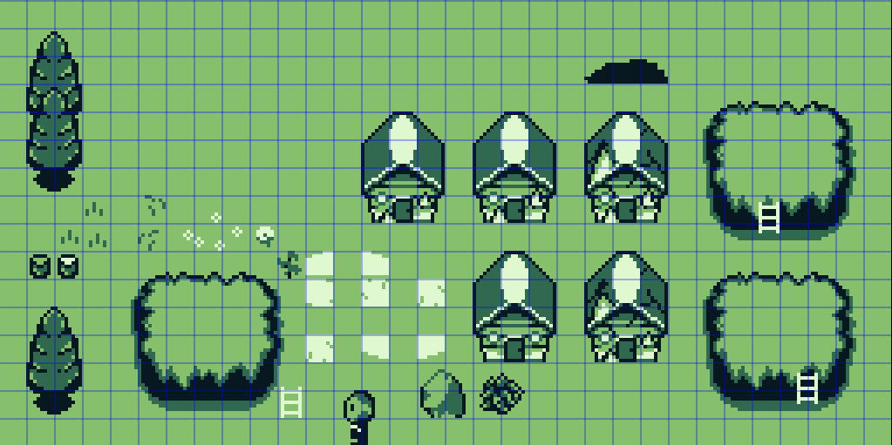
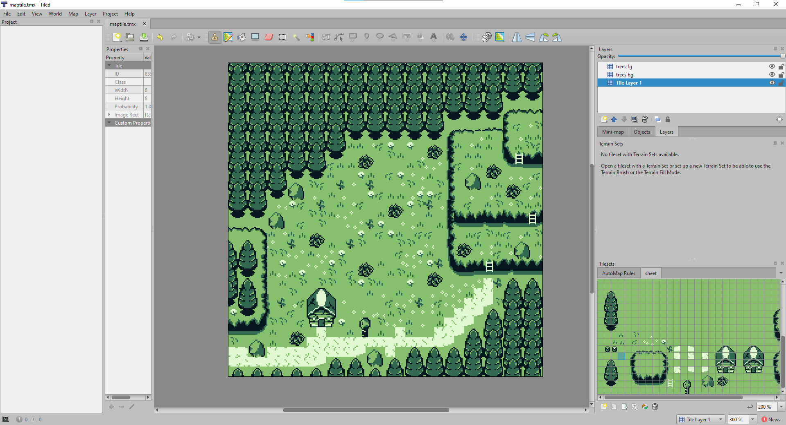

# Make a Thing | Process Journal

## 01/22/2026

Originally, I had some wholly different concepts in regards to a potential game or basic mechanics I could begin testing for the Make A Thing assignment. Therefore, with original concepts in mind, I decided to give Bitsy a go as I am unfamiliar with most game engines/programs—including this one.

As I learned my way around the program, I enjoyed its simplicity, but realized that it was rather too simple for the concepts I had in mind.

This was when I decided to change both the idea and game engine.

Rather than using this as an opportunity to test game mechanics, I decided to utilize GB Studio to tell a joke in the form of a game.

Booting up GB studio, I had absolutely no idea what I was doing. I fiddled around for a bit before looking up some tutorials, in which I found two channels—named Pixel Pete and Robert Doman which were my guideline into helping me achieve the results I wanted.

The integration of events and how the program worked seemed simple enough, therefore my first step was to acquire some sprites for my small game. Or in my case—create them.

I booted up Aseprite to model my player character as shown above, and I created the rest of the sprites for the environment as well. I had to learn the limitations and rules when creating sprites in regards to the Gameboy, such as the sprite sheet lengths and limited colour palette.

  
The next step was figuring out how to create the map utilizing repeating tiles, as the Gameboy only allows for a limited number of these unique tiles. Pixel Pete thankfully had a tutorial in regards to a program called Tiled which lets you easily drag and drop sprites from a spritesheet to create a map for your game, this is then later implemented as a ‘background’ in GB Studio.

With the map being completed and sprites following the guidelines of the Gameboy, the only step left was creating the events to make my game function, as well as adding collision to where this was necessary.

Little did I know, I was about to encounter my biggest roadblock. I realized that I did not know how to animate tile elements in the background, such as the fire in this case.

Thankfully, Robert Doman had a tutorial on creating animated backgrounds in GB Studio utilizing ‘tile replacement from sequence.’ This became a very tedious process that I did not anticipate, as I needed to go in and manually create short spritesheets for each individual 8x8 tile that would constantly swap with an integrated timer.

This was a very laborious process that took much longer than I thought. Yet, it managed to work without issue. Afterwards it was a simple matter of digging through the different event commands to get the interactions I wanted and voila. This is how I made a thing.
