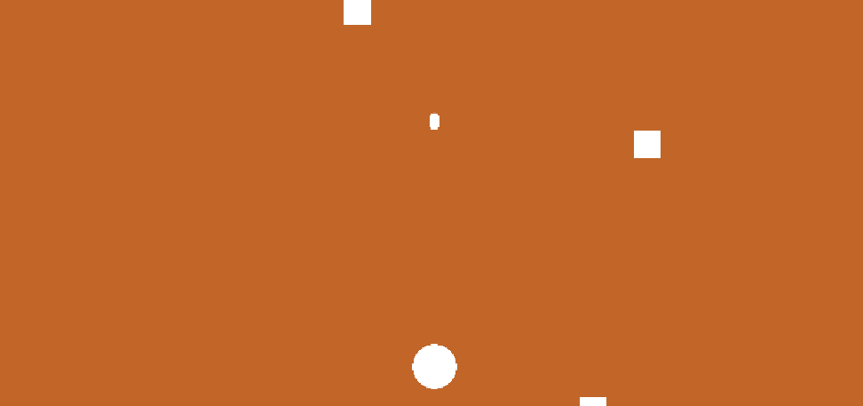
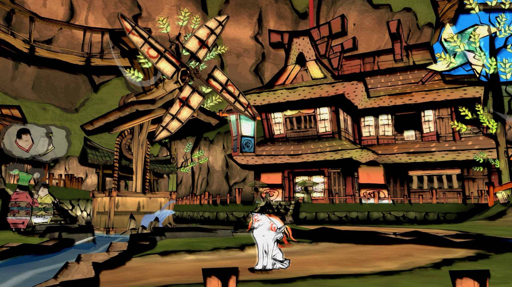
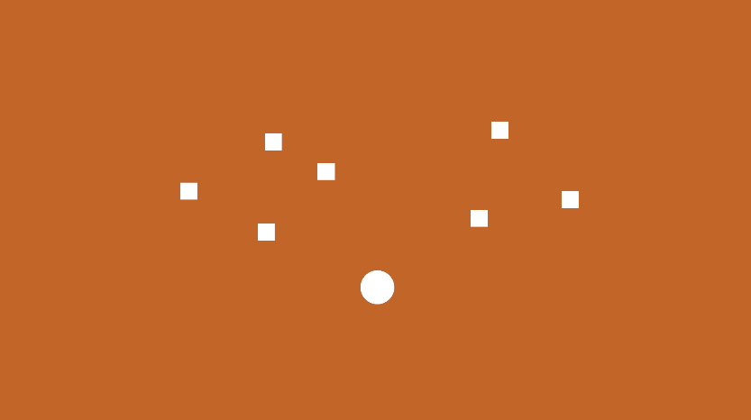
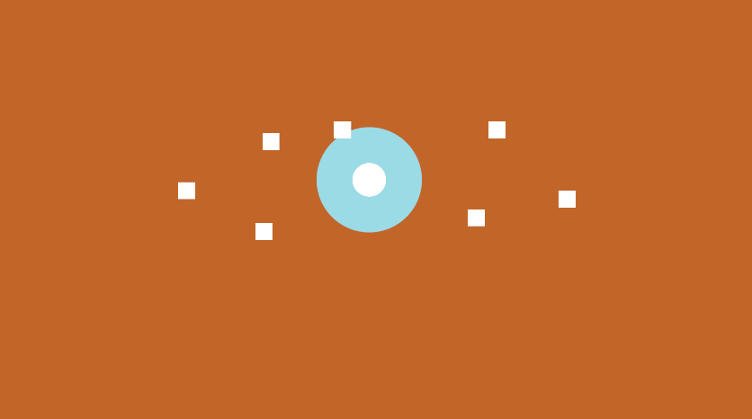
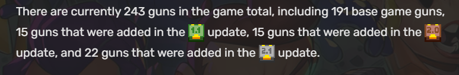
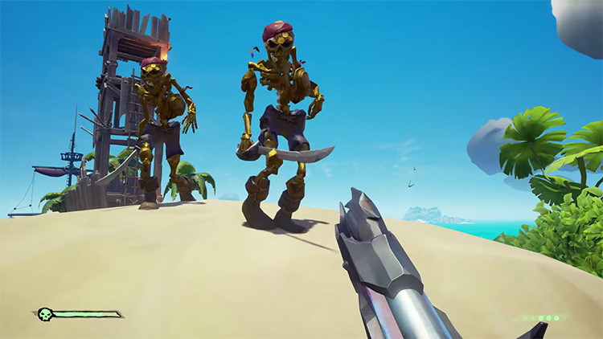
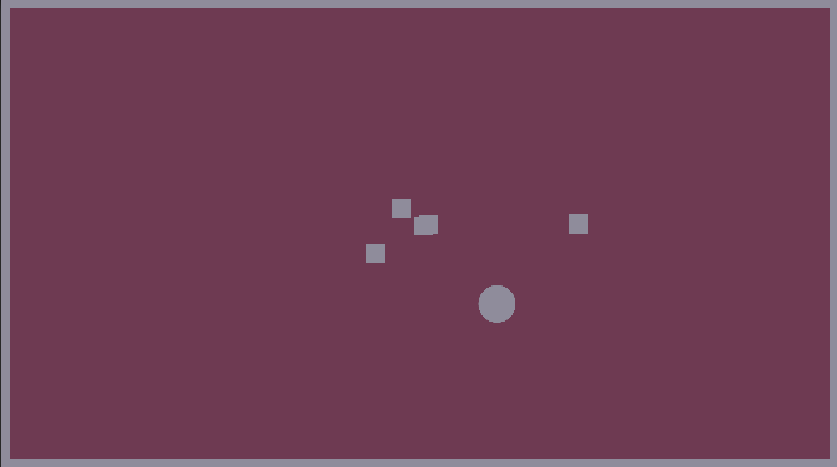
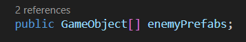
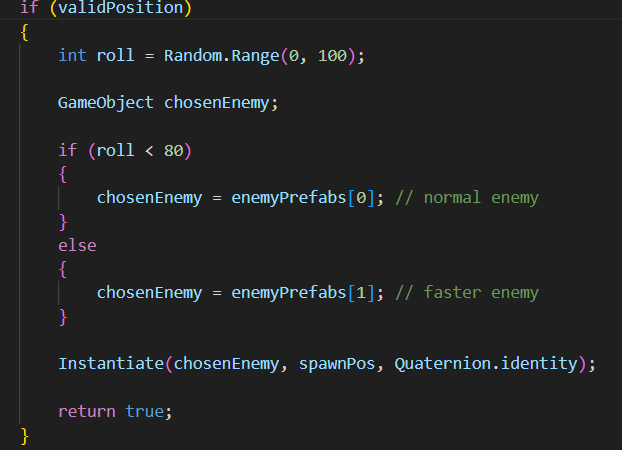
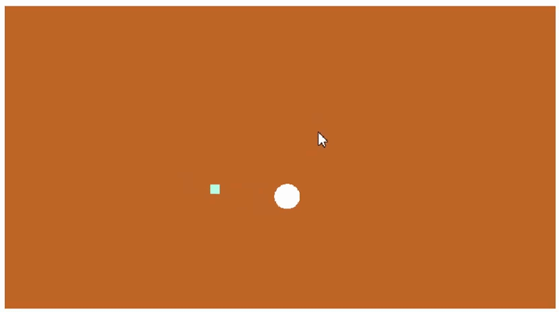

# Make a Thing | Process Journal

## 01/22/2026

Originally, I had some wholly different concepts in regards to a potential game or basic mechanics I could begin testing for the Make A Thing assignment. Therefore, with original concepts in mind, I decided to give Bitsy a go as I am unfamiliar with most game engines/programs—including this one.

As I learned my way around the program, I enjoyed its simplicity, but realized that it was rather too simple for the concepts I had in mind.

This was when I decided to change both the idea and game engine.

Rather than using this as an opportunity to test game mechanics, I decided to utilize GB Studio to tell a joke in the form of a game.

Booting up GB studio, I had absolutely no idea what I was doing. I fiddled around for a bit before looking up some tutorials, in which I found two channels—named Pixel Pete and Robert Doman which were my guideline into helping me achieve the results I wanted.

The integration of events and how the program worked seemed simple enough, therefore my first step was to acquire some sprites for my small game. Or in my case—create them.

I booted up Aseprite to model my player character as shown above, and I created the rest of the sprites for the environment as well. I had to learn the limitations and rules when creating sprites in regards to the Gameboy, such as the sprite sheet lengths and limited colour palette.

  
The next step was figuring out how to create the map utilizing repeating tiles, as the Gameboy only allows for a limited number of these unique tiles. Pixel Pete thankfully had a tutorial in regards to a program called Tiled which lets you easily drag and drop sprites from a spritesheet to create a map for your game, this is then later implemented as a ‘background’ in GB Studio.

With the map being completed and sprites following the guidelines of the Gameboy, the only step left was creating the events to make my game function, as well as adding collision to where this was necessary.

Little did I know, I was about to encounter my biggest roadblock. I realized that I did not know how to animate tile elements in the background, such as the fire in this case.

Thankfully, Robert Doman had a tutorial on creating animated backgrounds in GB Studio utilizing ‘tile replacement from sequence.’ This became a very tedious process that I did not anticipate, as I needed to go in and manually create short spritesheets for each individual 8x8 tile that would constantly swap with an integrated timer.

This was a very laborious process that took much longer than I thought. Yet, it managed to work without issue. Afterwards it was a simple matter of digging through the different event commands to get the interactions I wanted and voila. This is how I made a thing.

# First Prototype | Process Journal

## 01/29/2026

I decided to start making an extremely simple prototype of what is just watered-down space invaders with a circle, some capsule bullets and square enemies. I have been sick recently and had to miss class, therefore I used this opportunity to explore Unity as a program.

I am completely new to Unity and other game engines as a whole, as well as CSharp. So, for full disclosure, the scripts used in this simple prototype were made with AI. I only understand a bit as to what I am reading due to some small similarities with Javascript, a language I have only started learning last semester.

Initially, I wanted to go in a different direction and create a isometric top-down shooter, where enemies would constantly spawn around the player and then the player would be able to shoot them. However, I realized this would be a bit much for me as I did not know how to have my bullets fire on my mouse position as well as have the capsules (bullets) change their rotation to match the rotation/angle of my player character.

I barely knew how to navigate the program so I decided to just create some enemy squares that would fall down from the top of the screen and have the bullets only fire upward for now. This is an angle I can use to further improve upon this mechanic when I have a better understanding of Unity.

There are some other ideas I want to cover for larger projects but they are so out of reach from what I am currently capable of doing that I will keep them in my mind for now and try to attempt them at a later date.

As stated previously, I used this session to teach myself Unity as I find it quite confusing as a beginner to navigate. I learned what the Inspector and Hierarchy tabs are used for. I learned to better organize my work such as creating a Scripts and Prefabs folder. Most importantly, I learned how to create an object as a prefab and link it to other objects; i.e. the bullets that spawned from my player character every time I hit spacebar. Also how to detect collision with the enemy squares so that a bullet colliding with one would destroy both the enemy and the bullet.

I did try to implement my sprite I created for the MakeAThing project as my player character which had its own spritesheet and different sprites for whichever direction it would be facing. I watched a tutorial but found it too overwhelming for now and decided to keep it in my Sprites folder in my project to be used at a later date.

I also briefly looked over tags but still don't have a complete grasp as to what they do.

Overall, I'd say this was quite succesful and accomplished most of what I wanted to achieve, and learned some of the basics of Unity at the same time. I'm hoping to slowly build up to making an actual isometric top-down shooter and will continue working on that goal in the following weeks.

# Second Prototype | Process Journal

## 02/06/2026

I started this week off with a very general question: how do I slowly begin to build towards my eventual final project idea?
I'm aware that this phase of the course is geared more towards exploratory prototyping rather than a more narrow and concrete idea for the final project, but I'm deciding to start early. I have a (hopefully) feasible idea that I will be able to accomplish by the end of the course if all goes well.

My idea? A top-down isometric shooter, similar to games such as Enter the Gungeon or Cult of the Lamb, but rather than having it be primarily a shooter, I want it to be focused around spells or environmental changes that help defeat enemies in very specific ways.

I am primarily inspired by an old Playstation 2 game named Okami. This is a game where you have swords and other weapons to fight, but your main weapon is a brush, and you must draw with the controller to either change the environment around you or use specific 'abilities' to deal with tougher enemies. I.e. it's daytime and to solve a specific puzzle it must be night. Therefore, you pull out a scroll and draw a crescent to change the time of day.

Okami is a 3d semi-linear open world and something I do not think I will be able to replicate on time. A 2D top-down shooter with pixel art seems more feasible for my experience and timeframe.

## Further Questions

My general idea is solidified, now where to?

I need to narrow down my idea further. What are key components of an isometric top-down shooter?

There are:

- Enemies that spawn around you and chase and/or attack you
- Some form of shooting from the player (or abilities)
- Fast-paced movement
- An arena where the fighting takes place
- A locked camera that combined with pixel art simulates a somewhat 3D feel

Enemies seemed like the most logical step to tackle first. I'm planning on keeping the variety small as to not overachieve and keep expectations realistic for my skill and timeframe. I'm planning on adding 4 types, one slow, one fast, one ranged and one who can dodge with further variation that I will discuss in future journals.

Taking one step at a time, I decided to alter my first game prototype and just have my Enemy prefab spawn around me as opposed to falling from above, which I achieved. I also made sure to implement a space from each other so they would not spawn directly on top of one another.

They spawn at random coordinates across the scene up to a maximum of 10.

Bullet collision and having enemies be destroyed was already there from my last prototype, but my bullets only shot upwards.
Therefore, the next step was to have the bullet prefab capsules rotate and fire based on my mouse position from the player's position which worked.

I also added health bars for the enemies that would remain invisible, primarily so I could test a damage over time area of effect ability (as demonstrated by this blue circle).

This worked out fairly succesfully but one thing irked me, how come the enemies took so long to be destroyed?
I gave my enemies 100 health and set the damage over time effect to 20 damage per second when the enemies were inside.

This is how I found out how Time.deltaTime worked. The total damage per second that was calculated was based off of framerate rather than damage per frame.

For example, I set it to 100 damage per second, then it's 100 dps _ 0.016 seconds per frame ≈ 1.6
Then 1.6 _ 60 fps ≈ 96 damage per second.

This made some sense to me but I still found it odd, and I am unsure if I will go back to change the way my damage works sometime in the near future.

This took me a while as I am still slowly trying to understand C#, as many parts of it confuse me and as before, I had AI help me with the script code. I am not just blindly copy and pasting but still trying to understand what I am coding to the best of my ability.

I want to continue down this path of implementation prototyping for now, as I have not sweated the visual details or world-building yet. I have ideas, but those will be tested later on.

# Third Prototype | Process Journal

## 02/11/2026

Following up from my previous journal, I continued my work on the enemies. I previously stated that enemies follow the player to attack them in most isometric top-down shooters, and this is exactly what I strived to do for the continuation of my prototype game.

The enemies previously spawned and just stood still, therefore I began by making them follow the player, which was honestly much more simple than I thought. It is very primitive as all they do are track the player's current position, but it wasn't as tricky as I initially thought.

However, I did encounter an issue. I coded in a radius so that enemies would randomly spawn a minimum distance around each other to prevent clipping and weird looking spawns in the relative same position, but this caused them to begin spawning outside the visible scene/arena. Therefore, I created some walls on the outside and updated their script to prevent spawning outside and/or within the walls themselves.

## How do I differentiate my game from others of its type?

This is a question I've had on my mind since I first envisioned the concept. I previously mentioned Okami, which used an ink brush that allowed you to draw upon the elements and the world around you to attack or solve puzzles. I have also recently seen a small indie game in development (that I forgot the name of) in which it is very similar to what I'm doing, being a top-down shooter. However, you draw on your screen to cast spells in order to defeat enemies. This was super cool and something that I previously thought of doing, but I decided to go down another route. This was primarily to avoid overlap, as I wanted mine to be different from others.

There is no issue with taking an existing game concept and innovating upon it, absolutely not. This is quite common in the games industry, look at Warframe, Destiny 2, and the now defunct Anthem. These are all looter shooters with their own unique twist. Warframe's unique spin is its third-person camera and highly fluid and advanced movement. Destiny 2 falls under a first-person shooter with RPG elements, such as unique abilities, classes and ultimates. Anthem's whole draw was that you primarily fought in giant mechs. These are all unique and different in their own right, but at their core they all had a very similar gameplay loop.

You can see where I'm going with this, as I want to differentiate from other isometric top-down shooters, like Enter the Gungeon, Cult of the Lamb, the Binding of Isaac, Hades, among many others. My unique twist was the gesture-recognition system that Okami is most known for. That was until I came across the one spell-casting indie game of a similar nature.

There is also the issue of time and scope. I am but one student who is new to game development and I do not want to fall victim to scope creep(?). I want to simplify things for myself that allows me to still deliver a playable product by the end of the semester. Therefore I am ruling out the possibility of multiple weapons that many top-down shooters have. Creating the visuals and mechanics of multiple weapons takes a lot of time, and that is time I do not and will not have.

One of the core aspects of top-down shooters that makes them engaging are multiple weapon variants and different but unique abilities. I failed to address this properly in my last journal but most games within the genre often have many different types of weapons that serve various purposes, abilities to compliment those weapons and often times power-ups are involved to drastically increase the scale of a player's power fantasy.

Case and point:

## If I do not have multiple weapons, than what do I do??

Abilities are essential with the gesture-recognition system, so I am planning on adding a few at least, hopefully several, but what else?

Weather.

I thought of this on a whim but a dynamic weather system that interacts with how you deal with enemies is not something I often see, let alone in this genre. I want each weather condition to interact with enemies in their own unique way and possibly contain interaction with abilities if I have the time. Though I am not sure.

I want to add at least 3 different weather types, not including base weather (i.e. no effect on gameplay).

I have yet to work out the others but I have decided that rainy weather will be my first test as I have an idea of what it will do. First and foremost the rain will slow enemies down overall for its duration which will help in strafing around them. I am also leaning on a more futuristic aesthetic where most enemies will have cybernetic parts or just be robots. This is important to bring up now as I was thinking that the rain will either fry or mess with their circuitry, either making them more vulnerable to damage or even allowing certain previous indestructible enemies to be able to take damage.

Sea of Thieves does something like this where specific gold-plated skeletons can only be killed when wet and rusting, either by fighting them in the rain, within bodies of water or tossing water onto them with your bucket.

I will allow the player to be able to control the weather in some manner by drawing certain symbols, so it creates an interesting dynamic that (especially newer) players will have to think about and overcome in order to progress, as metal and water do not traditionally mix well.

Therefore, the last thing I coded in was a toggle to create a blue rectangle that represents the rain and lasts for 10 seconds, during which time all enemies following me are slowed by 40% for its duration.

I have been typing for a while now, so to cut it short, this is the direction I am planning on taking the game, which I will continue to improve overtime with each one of these sessions and journals.

# Fourth Prototype Version | Process Journal

## 02/18/2026

This journal entry will be relatively short as I have a couple midterms due soon so I was not able to continue working on my idea that extensively.

..It just dawned on me that I have been titling each entry as if they were different prototypes when I have only been working on one, but it's too late at this point since I don't want to break any past links, therefore I will make adjustments going forward.

I also want to mention that most of these prototype versions seem relatively small in terms of changes between each other, but even with the help of AI for some, these can take me many hours to figure out as I am completely new to Unity and C#. So, for some who are more experienced this may seem like nothing, but it takes a while for me. I've been working at my own pace making small but meaningful adjustments between each version and I am happy with the progress so far.

Anyways, with that being said, I was able to implement two small additions this week that drastically improve the rather boring gameplay loop from my previous prototype version.

The first was creating the infrastructure to be able to spawn multiple types of enemies with weighted spawns, so some would spawn more than others. This.. was a lot easier than I thought. Most of the infrastructure was already in place. All I had to do was change the enemy spawner variable into an array and plug in both my enemies into said array within the engine.

Furthermore, I knew that I needed my basic enemy to spawn more often than other special varients, so I added a random range weighted spawn system, which made my basic slow-moving enemies significantly more common.

Aaand that was it. That was really easy.

But oh boy was I not ready for the next addition.

I wanted to implement a dash, as it helps add fluidity and gives the combat a more dynamic flow to it, rather than being stale and rigid as it has been prior.

I decided to follow a tutorial by a channel named BMo: https://www.youtube.com/watch?v=VWaiU7W5HdE

This was when I ran into a very specific issue.
The previous movement system for my player was primitive, utilizing transform. Translate which essentially just teleports my player every frame, which is not what I want. If I wanted to follow the tutorial properly, I needed to utilize RigidBody2D which, from my understanding, uses physics-based movement. This took a while for me to understand but it does seem like the physics-based movement is just a better and more dynamic way to implement movement even on a 2D plane.

## Looking Forward

Progress has been slow but steady. Although, I realize we are approaching week 7 already and I need to pick up the pace. After this week, additions and changes should be much larger in scale and more frequent.

There's the elephant in the room I need to address regarding the action input system I plan on implementing for this prototype. This will be by far the largest hurdle that I will need to overcome aside from the visuals. I plan on utilizing the break to work on both of these.

I also originally planned on continuing work on the weather system I praised and spoke about last week, but I have doubts. I still may be falling victim to scope creep, as I don't think I will be able to fully implement my idea regarding that in the limited time I have left. I may scrap it entirely or just keep the rain weather as a sort of spell/ability, I am not sure yet.

Regardless, I must stay focused and work harder on the core systems and mechanics to create something that is uniquely fun, while worrying about additional features later.
