# Make a Thing | Process Journal

## 01/22/2026

Originally, I had some wholly different concepts in regards to a potential game or basic mechanics I could begin testing for the Make A Thing assignment. Therefore, with original concepts in mind, I decided to give Bitsy a go as I am unfamiliar with most game engines/programs—including this one.

As I learned my way around the program, I enjoyed its simplicity, but realized that it was rather too simple for the concepts I had in mind.

This was when I decided to change both the idea and game engine.

Rather than using this as an opportunity to test game mechanics, I decided to utilize GB Studio to tell a joke in the form of a game.

Booting up GB studio, I had absolutely no idea what I was doing. I fiddled around for a bit before looking up some tutorials, in which I found two channels—named Pixel Pete and Robert Doman which were my guideline into helping me achieve the results I wanted.

The integration of events and how the program worked seemed simple enough, therefore my first step was to acquire some sprites for my small game. Or in my case—create them.

I booted up Aseprite to model my player character as shown above, and I created the rest of the sprites for the environment as well. I had to learn the limitations and rules when creating sprites in regards to the Gameboy, such as the sprite sheet lengths and limited colour palette.

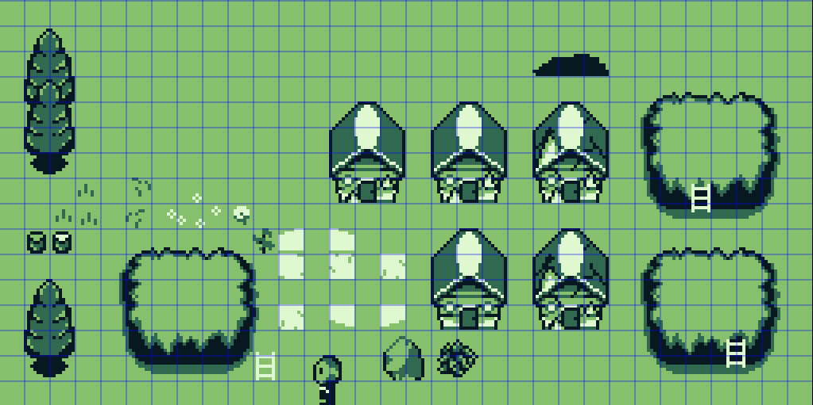  
The next step was figuring out how to create the map utilizing repeating tiles, as the Gameboy only allows for a limited number of these unique tiles. Pixel Pete thankfully had a tutorial in regards to a program called Tiled which lets you easily drag and drop sprites from a spritesheet to create a map for your game, this is then later implemented as a ‘background’ in GB Studio.

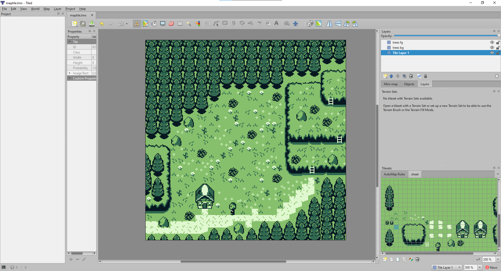

With the map being completed and sprites following the guidelines of the Gameboy, the only step left was creating the events to make my game function, as well as adding collision to where this was necessary.

Little did I know, I was about to encounter my biggest roadblock. I realized that I did not know how to animate tile elements in the background, such as the fire in this case.

Thankfully, Robert Doman had a tutorial on creating animated backgrounds in GB Studio utilizing ‘tile replacement from sequence.’ This became a very tedious process that I did not anticipate, as I needed to go in and manually create short spritesheets for each individual 8x8 tile that would constantly swap with an integrated timer.

This was a very laborious process that took much longer than I thought. Yet, it managed to work without issue. Afterwards it was a simple matter of digging through the different event commands to get the interactions I wanted and voila. This is how I made a thing.

# First Prototype | Process Journal

## 01/29/2026

I decided to start making an extremely simple prototype of what is just watered-down space invaders with a circle, some capsule bullets and square enemies. I have been sick recently and had to miss class, therefore I used this opportunity to explore Unity as a program.

I am completely new to Unity and other game engines as a whole, as well as CSharp. So, for full disclosure, the scripts used in this simple prototype were made with AI. I only understand a bit as to what I am reading due to some small similarities with Javascript, a language I have only started learning last semester.

Initially, I wanted to go in a different direction and create a isometric top-down shooter, where enemies would constantly spawn around the player and then the player would be able to shoot them. However, I realized this would be a bit much for me as I did not know how to have my bullets fire on my mouse position as well as have the capsules (bullets) change their rotation to match the rotation/angle of my player character.

I barely knew how to navigate the program so I decided to just create some enemy squares that would fall down from the top of the screen and have the bullets only fire upward for now. This is an angle I can use to further improve upon this mechanic when I have a better understanding of Unity.

There are some other ideas I want to cover for larger projects but they are so out of reach from what I am currently capable of doing that I will keep them in my mind for now and try to attempt them at a later date.

As stated previously, I used this session to teach myself Unity as I find it quite confusing as a beginner to navigate. I learned what the Inspector and Hierarchy tabs are used for. I learned to better organize my work such as creating a Scripts and Prefabs folder. Most importantly, I learned how to create an object as a prefab and link it to other objects; i.e. the bullets that spawned from my player character every time I hit spacebar. Also how to detect collision with the enemy squares so that a bullet colliding with one would destroy both the enemy and the bullet.

I did try to implement my sprite I created for the MakeAThing project as my player character which had its own spritesheet and different sprites for whichever direction it would be facing. I watched a tutorial but found it too overwhelming for now and decided to keep it in my Sprites folder in my project to be used at a later date.

I also briefly looked over tags but still don't have a complete grasp as to what they do.

Overall, I'd say this was quite succesful and accomplished most of what I wanted to achieve, and learned some of the basics of Unity at the same time. I'm hoping to slowly build up to making an actual isometric top-down shooter and will continue working on that goal in the following weeks.

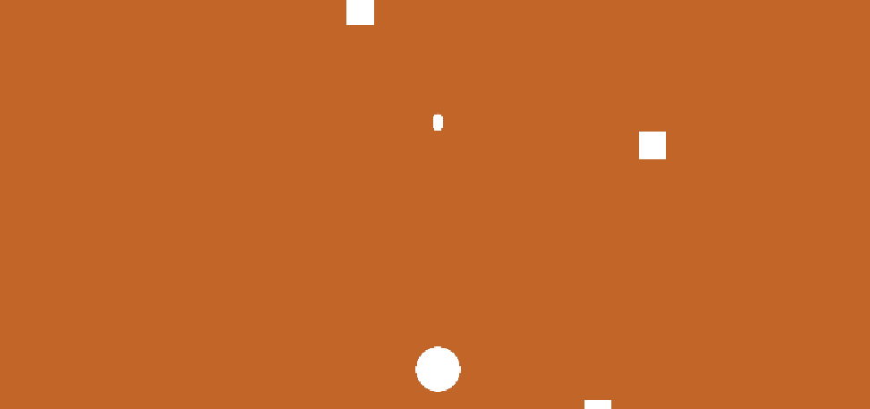

# Second Prototype | Process Journal

## 02/06/2026

I started this week off with a very general question: how do I slowly begin to build towards my eventual final project idea?
I'm aware that this phase of the course is geared more towards exploratory prototyping rather than a more narrow and concrete idea for the final project, but I'm deciding to start early. I have a (hopefully) feasible idea that I will be able to accomplish by the end of the course if all goes well.

My idea? A top-down isometric shooter, similar to games such as Enter the Gungeon or Cult of the Lamb, but rather than having it be primarily a shooter, I want it to be focused around spells or environmental changes that help defeat enemies in very specific ways.

I am primarily inspired by an old Playstation 2 game named Okami. This is a game where you have swords and other weapons to fight, but your main weapon is a brush, and you must draw with the controller to either change the environment around you or use specific 'abilities' to deal with tougher enemies. I.e. it's daytime and to solve a specific puzzle it must be night. Therefore, you pull out a scroll and draw a crescent to change the time of day.

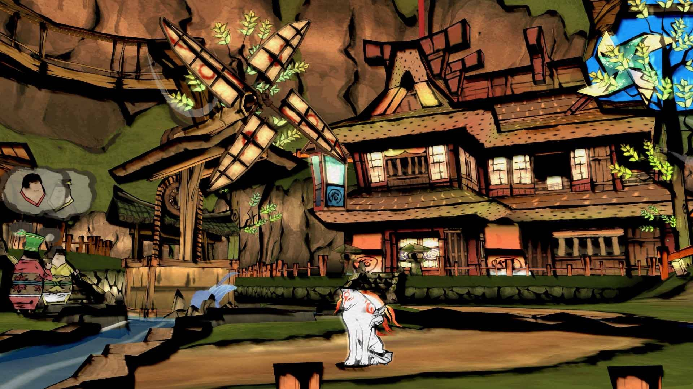

Okami is a 3d semi-linear open world and something I do not think I will be able to replicate on time. A 2D top-down shooter with pixel art seems more feasible for my experience and timeframe.

## Further Questions

My general idea is solidified, now where to?

I need to narrow down my idea further. What are key components of an isometric top-down shooter?

There are:

- Enemies that spawn around you and chase and/or attack you
- Some form of shooting from the player (or abilities)
- Fast-paced movement
- An arena where the fighting takes place
- A locked camera that combined with pixel art simulates a somewhat 3D feel

Enemies seemed like the most logical step to tackle first. I'm planning on keeping the variety small as to not overachieve and keep expectations realistic for my skill and timeframe. I'm planning on adding 4 types, one slow, one fast, one ranged and one who can dodge with further variation that I will discuss in future journals.

Taking one step at a time, I decided to alter my first game prototype and just have my Enemy prefab spawn around me as opposed to falling from above, which I achieved. I also made sure to implement a space from each other so they would not spawn directly on top of one another.

They spawn at random coordinates across the scene up to a maximum of 10.

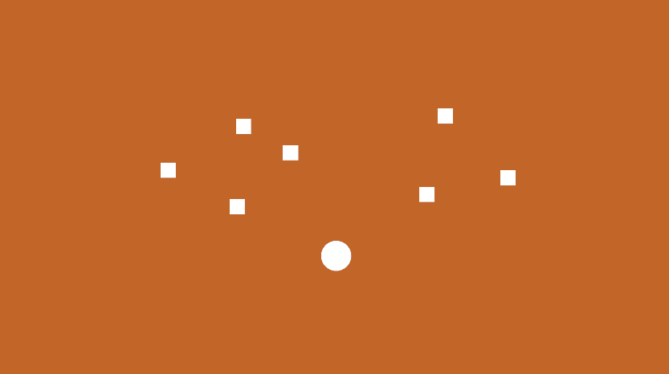

Bullet collision and having enemies be destroyed was already there from my last prototype, but my bullets only shot upwards.
Therefore, the next step was to have the bullet prefab capsules rotate and fire based on my mouse position from the player's position which worked.

I also added health bars for the enemies that would remain invisible, primarily so I could test a damage over time area of effect ability (as demonstrated by this blue circle).

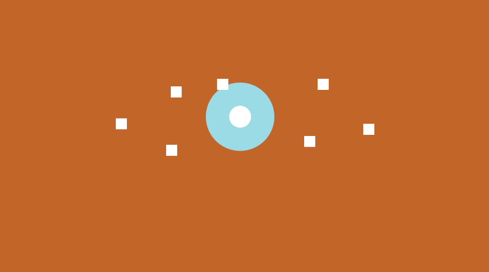

This worked out fairly succesfully but one thing irked me, how come the enemies took so long to be destroyed?
I gave my enemies 100 health and set the damage over time effect to 20 damage per second when the enemies were inside.

This is how I found out how Time.deltaTime worked. The total damage per second that was calculated was based off of framerate rather than damage per frame.

For example, I set it to 100 damage per second, then it's 100 dps _ 0.016 seconds per frame ≈ 1.6
Then 1.6 _ 60 fps ≈ 96 damage per second.

This made some sense to me but I still found it odd, and I am unsure if I will go back to change the way my damage works sometime in the near future.

This took me a while as I am still slowly trying to understand C#, as many parts of it confuse me and as before, I had AI help me with the script code. I am not just blindly copy and pasting but still trying to understand what I am coding to the best of my ability.

I want to continue down this path of implementation prototyping for now, as I have not sweated the visual details or world-building yet. I have ideas, but those will be tested later on.

# Third Prototype | Process Journal

## 02/11/2026

Following up from my previous journal, I continued my work on the enemies. I previously stated that enemies follow the player to attack them in most isometric top-down shooters, and this is exactly what I strived to do for the continuation of my prototype game.

The enemies previously spawned and just stood still, therefore I began by making them follow the player, which was honestly much more simple than I thought. It is very primitive as all they do are track the player's current position, but it wasn't as tricky as I initially thought.

However, I did encounter an issue. I coded in a radius so that enemies would randomly spawn a minimum distance around each other to prevent clipping and weird looking spawns in the relative same position, but this caused them to begin spawning outside the visible scene/arena. Therefore, I created some walls on the outside and updated their script to prevent spawning outside and/or within the walls themselves.

## How do I differentiate my game from others of its type?

This is a question I've had on my mind since I first envisioned the concept. I previously mentioned Okami, which used an ink brush that allowed you to draw upon the elements and the world around you to attack or solve puzzles. I have also recently seen a small indie game in development (that I forgot the name of) in which it is very similar to what I'm doing, being a top-down shooter. However, you draw on your screen to cast spells in order to defeat enemies. This was super cool and something that I previously thought of doing, but I decided to go down another route. This was primarily to avoid overlap, as I wanted mine to be different from others.

There is no issue with taking an existing game concept and innovating upon it, absolutely not. This is quite common in the games industry, look at Warframe, Destiny 2, and the now defunct Anthem. These are all looter shooters with their own unique twist. Warframe's unique spin is its third-person camera and highly fluid and advanced movement. Destiny 2 falls under a first-person shooter with RPG elements, such as unique abilities, classes and ultimates. Anthem's whole draw was that you primarily fought in giant mechs. These are all unique and different in their own right, but at their core they all had a very similar gameplay loop.

You can see where I'm going with this, as I want to differentiate from other isometric top-down shooters, like Enter the Gungeon, Cult of the Lamb, the Binding of Isaac, Hades, among many others. My unique twist was the gesture-recognition system that Okami is most known for. That was until I came across the one spell-casting indie game of a similar nature.

There is also the issue of time and scope. I am but one student who is new to game development and I do not want to fall victim to scope creep(?). I want to simplify things for myself that allows me to still deliver a playable product by the end of the semester. Therefore I am ruling out the possibility of multiple weapons that many top-down shooters have. Creating the visuals and mechanics of multiple weapons takes a lot of time, and that is time I do not and will not have.

One of the core aspects of top-down shooters that makes them engaging are multiple weapon variants and different but unique abilities. I failed to address this properly in my last journal but most games within the genre often have many different types of weapons that serve various purposes, abilities to compliment those weapons and often times power-ups are involved to drastically increase the scale of a player's power fantasy.

Case and point:

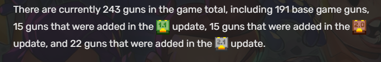

## If I do not have multiple weapons, than what do I do??

Abilities are essential with the gesture-recognition system, so I am planning on adding a few at least, hopefully several, but what else?

Weather.

I thought of this on a whim but a dynamic weather system that interacts with how you deal with enemies is not something I often see, let alone in this genre. I want each weather condition to interact with enemies in their own unique way and possibly contain interaction with abilities if I have the time. Though I am not sure.

I want to add at least 3 different weather types, not including base weather (i.e. no effect on gameplay).

I have yet to work out the others but I have decided that rainy weather will be my first test as I have an idea of what it will do. First and foremost the rain will slow enemies down overall for its duration which will help in strafing around them. I am also leaning on a more futuristic aesthetic where most enemies will have cybernetic parts or just be robots. This is important to bring up now as I was thinking that the rain will either fry or mess with their circuitry, either making them more vulnerable to damage or even allowing certain previous indestructible enemies to be able to take damage.

Sea of Thieves does something like this where specific gold-plated skeletons can only be killed when wet and rusting, either by fighting them in the rain, within bodies of water or tossing water onto them with your bucket.

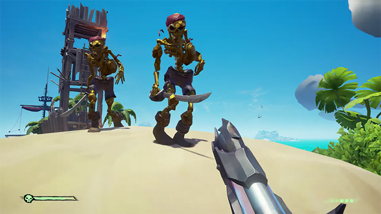

I will allow the player to be able to control the weather in some manner by drawing certain symbols, so it creates an interesting dynamic that (especially newer) players will have to think about and overcome in order to progress, as metal and water do not traditionally mix well.

Therefore, the last thing I coded in was a toggle to create a blue rectangle that represents the rain and lasts for 10 seconds, during which time all enemies following me are slowed by 40% for its duration.

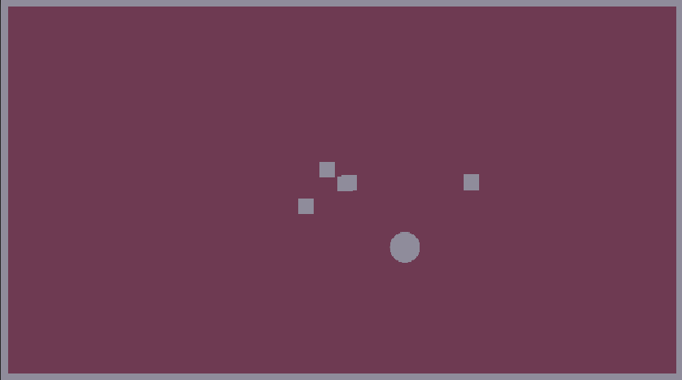

I have been typing for a while now, so to cut it short, this is the direction I am planning on taking the game, which I will continue to improve overtime with each one of these sessions and journals.

# Fourth Prototype Version | Process Journal

## 02/18/2026

This journal entry will be relatively short as I have a couple midterms due soon so I was not able to continue working on my idea that extensively.

..It just dawned on me that I have been titling each entry as if they were different prototypes when I have only been working on one, but it's too late at this point since I don't want to break any past links, therefore I will make adjustments going forward.

Anyways, with that being said, I was able to implement two small additions this week that drastically improve the rather boring gameplay loop from my previous prototype version.

The first was creating the infrastructure to be able to spawn multiple types of enemies with weighted spawns, so some would spawn more than others. This.. was a lot easier than I thought. Most of the infrastructure was already in place. All I had to do was change the enemy spawner variable into an array and plug in both my enemies into said array within the engine.

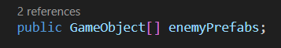

Furthermore, I knew that I needed my basic enemy to spawn more often than other special varients, so I added a random range weighted spawn system, which made my basic slow-moving enemies significantly more common.

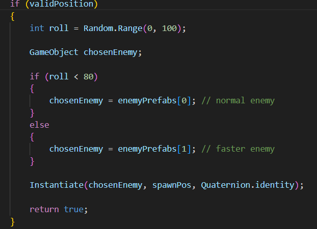

Aaand that was it. That was really easy.

But oh boy was I not ready for the next addition.

I wanted to implement a dash, as it helps add fluidity and gives the combat a more dynamic flow to it, rather than being stale and rigid as it has been prior.

I decided to follow a tutorial by a channel named BMo: https://www.youtube.com/watch?v=VWaiU7W5HdE

This was when I ran into a very specific issue.
The previous movement system for my player was primitive, utilizing transform. Translate which essentially just teleports my player every frame, which is not what I want. If I wanted to follow the tutorial properly, I needed to utilize RigidBody2D which, from my understanding, uses physics-based movement. This took a while for me to understand but it does seem like the physics-based movement is just a better and more dynamic way to implement movement even on a 2D plane.

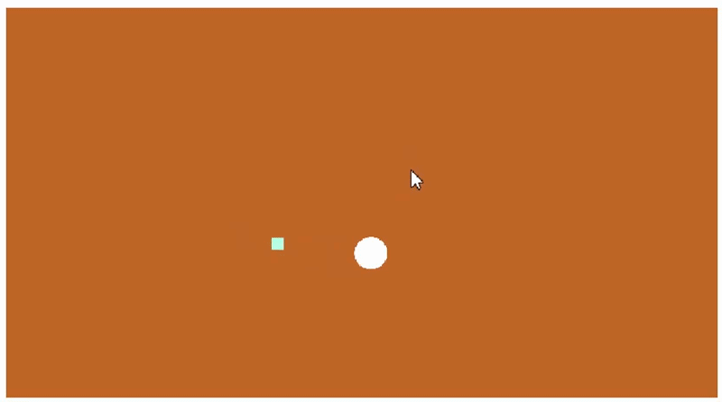

## Looking Forward

Progress has been slow but steady. Although, I realize we are approaching week 7 already and I need to pick up the pace. After this week, additions and changes should be much larger in scale and more frequent.

There's the elephant in the room I need to address regarding the action input system I plan on implementing for this prototype. This will be by far the largest hurdle that I will need to overcome aside from the visuals. I plan on utilizing the break to work on both of these.

I also originally planned on continuing work on the weather system I praised and spoke about last week, but I have doubts. I still may be falling victim to scope creep, as I don't think I will be able to fully implement my idea regarding that in the limited time I have left. I may scrap it entirely or just keep the rain weather as a sort of spell/ability, I am not sure yet.

Regardless, I must stay focused and work harder on the core systems and mechanics to create something that is uniquely fun, while worrying about additional features later.

# First Ideation Prototype | Process Journal

## 02/25/2026

### UX vs Systemic Approach

Last class' idea workshop left me rethinking my approach a bit as to what I want to do and how I should go about it. I'm left wondering now if I should continue with what I have been working towards this entire time or try a different approach. This is still something that I'm unsure of and will have to give it more thought over the break. However, two things remained stagnant: that I want an action input system in my game, no doubt about it, regardless of what I do as I think it's such a creative and fun way to shake up normal gameplay that hasn't been done much before. The other was a question that I was asked by Jeremy(?) when discussing my ideas. That question was: how do you want to make the players feel? Rather than thinking from a purely mechanical and systemic point of view.

This is a question that is and has still stuck with me for a while, as upon hearing it, I almost immediately wrote it down so I wouldn't forget. I am aware of the irony that I spoke about wanting to take a step back and approach my idea from a more theoretical stance, yet still sticking with the one mechanic that I want, but the way I approached how I implemented said mechanic was different because of the question.

Before I did anything, I needed a way to add tension in my game so that I will be able to better test out the questions that I asked myself, which I will show later.
Because prior, enemies did nothing but follow, and there was almost no tension to be able to stress test my ideas. Therefore, I added player health and a way for enemies to damage you when they came into collision within a certain radius. This was something I should have implemented way sooner, but it was absolutely crucial for my tests later on.

### Action Input System

I followed this tutorial by Night Run Studio which was relatively easy to follow and setup for my own game: https://www.youtube.com/watch?v=vSxkfzNksQ0. After some fine tuning and adjustments, I was ready to ask myself the second question: How would I create a similar gesture/action input system like that found in Okami, but within Unity?

I was almost clueless on this, as I had completely forgotten at the time what it was called or if it was even possible to accomplish this within Unity. Google didn't yield many results. However, I came across this Unity forum post from all the way back in 2010 asking the same question that I had. https://discussions.unity.com/t/okami-like/424438/3

User tonyd mentioned the Input.mousePosition line of code and I took off from there.

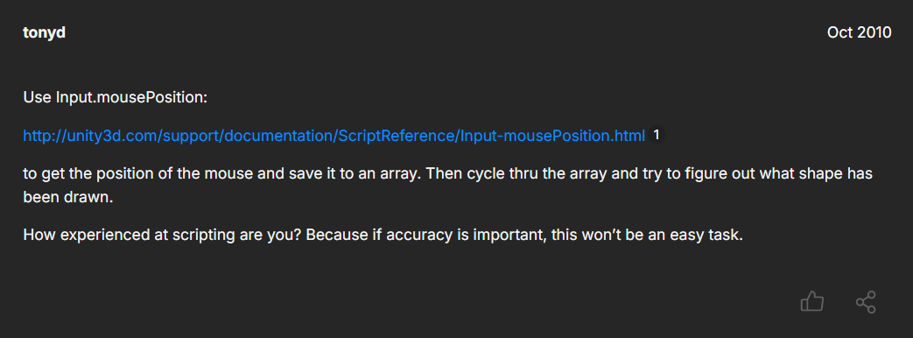

Being very inexperienced in Unity and C#, I threw this reply into ChatGPT to see what it will give me. On a sidenote, I have been trying to rely on AI a lot less, but this was something far too complex for me right now so I felt this was the one time I should rely on it, and also it would be easier to describe the shape that I wanted rather than me manually mapping out the shape that I wanted.

### Flow like Mud

For once, AI was actually really helpful and gave me a functioning script code that I was able to plug into an empty so it could recognize what I was drawing. This led me to my third question: even with the very mechanically limited game I have right now, does it flow well?

This is why I needed to add player damage and death, so I could stress test that exact scenario. I originally wanted a fast-paced top-down shooter, where drawing simultaneously as moving around and shooting would flow well into a seamless gameplay loop that allowed the user to pull off some theoretically satisfying maneuvers and fast-paced combos when I implemented a more intricate combat system. But, uh, no. I very much thought wrong. It was slow, clunky, and did not flow well into dashing, moving and shooting at all. It felt pretty bad being chased by enemies while you tried to draw something and dash away, which would only worsen as that stress made drawing even more difficult. I was using a mouse, I could only imagine how awful it would feel with a trackpad. There would be a lot of scenarios where you had to find an empty spot and just stand still to draw while praying that a faster enemy wouldn't catch up. It removed a lot of player agency and led to stressful scenarios. As seen here, it did not work well with a very one-dimensional system like I had, and I could only imagine how annoying and frustrating the user experience would be if I had a more intricate movement and combat system.

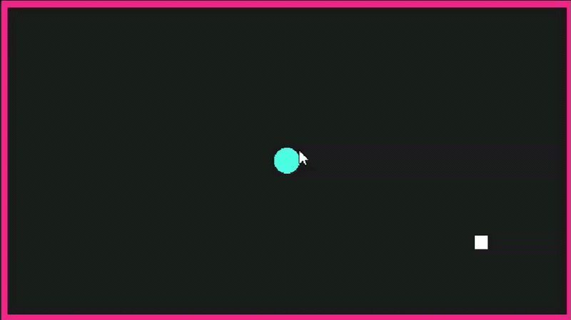

Okami remedies this by pausing the entire game when holding down a button to draw, which, in that game I think worked quite well, even in intense combat. I was under the impression that it would lead into a disruptive loop, where the player would be in the rhythm of shooting and avoiding enemies, and having to pause the game to draw would not be very satisfying. I had to rethink my approach. Even in intense combat, the way the brush techniques were implemented into Okami flow well, and were satisfying to pull off, even in puzzle scenarios.

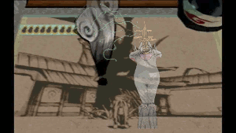

All pausing the game did was allow the player to have more agency without stressing about the controls and allowing them to take these matters into their own hands while in the thick of it.

### Less Anxiety, the Better

Despite earlier reservations, this is how I decided to continue forward.

There were some issues with action recognition, as on initial testing, all I had to do was draw a line and it would recognise it as an accepted shape.

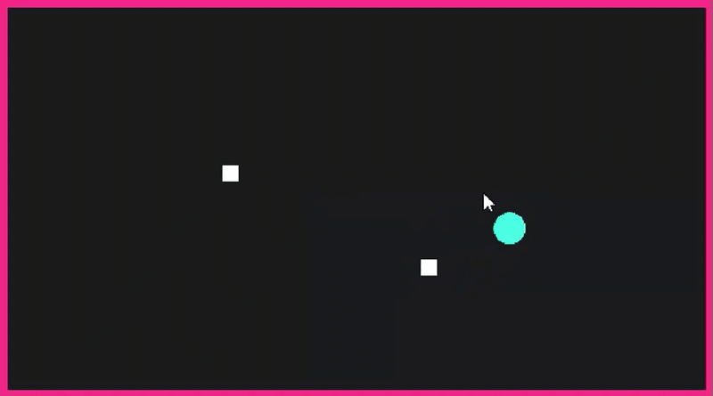

My solution was to ask AI to refine the shape, make it more strict, and define the rain drop shape as circular with the bottom being wider than the top, which seemed to work. I also just had to add a boolean to check if the desired shape was accepted so that the game would unpause after drawing a correct one, which got rid of the redundancy of needing to let go of the draw button after drawing any shape. If you drew the correct symbol, bam, back into the gameplay you go. This was a well needed change for better user experience and improved combat flow.

Once again, despite earlier thoughts about flow, this felt so much better to play than previously. It felt almost naturally. The brief pause in combat was relaxing and I did not feel that it disrupted the flow of combat all too much, rather it allowed the player to regain their ground and get right back into it without much hassle.

Oh and I just used a rain drop shape to activate the rain system I have previously implemented as a test/placeholder.

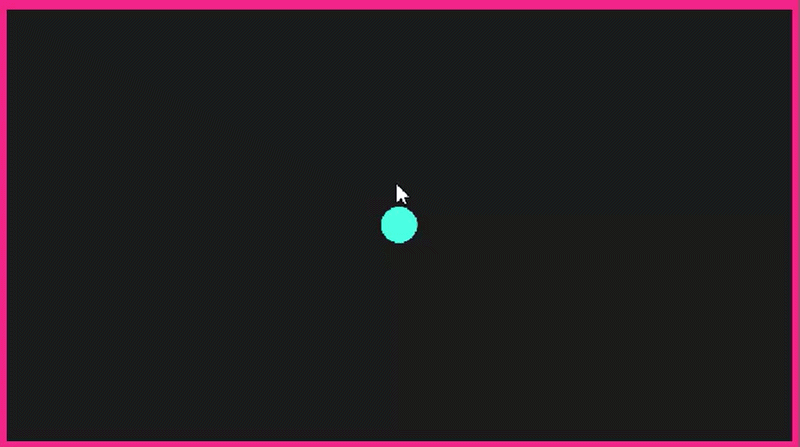

# Second Ideation Prototype | Process Journal

## 03/11/2026

### Shifting Ideas

Over the break, I've been debating on switching my idea. This began during the class before the break, where one line stood out in particular during the presentation: the fact that many junior designers often trap themselves by staying attached to a certain idea. I feel like that has been me throughout the entire semester; clinging to the idea of a input action system in a 2D game. I feel like I've trapped myself by not brainstorming and/or prototyping enough. Therefore, I decided to restart from scratch.

I did mess up last journal entry by not conceptualizing and progressing through the ideas I made during the ideation workshop the week prior. I was too attached to my previous idea, and did not resonate with the ideas that were made during the workshop, aside from one. However, that one idea was way too complex and time consuming for the scope of this course.

I decided to enact my own mini ideation workshop.

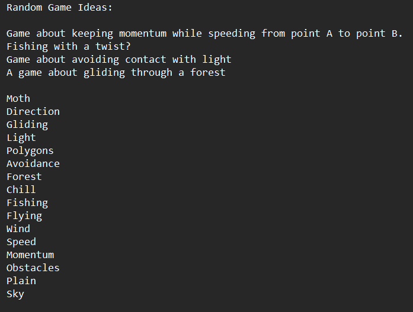

Initially, I was hooked on the idea of speed and momentum, utilizing physics to reach from point A to B, akin to the game Haste.

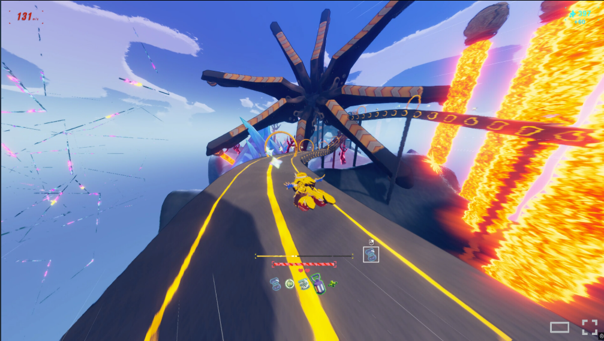

I used the combination of words: Momentum + Flying + Gliding
I was inspired by Guild Wars 2's griffon gliding system and Haste's momentum to create a game where the player glides through an environment from one point to another, utilizing bursts of wind and maneuvers to maintain speed without stalling. This reminded me of the game Sky: Children of the light. A social game where each player is a moth that is able to glide through beautiful scenic environments with others, and collecting light to be spent on cosmetics.

This was the main gameplay loop for Sky: CotL: Glide through beautiful environments, socialize, explore, collect resource, spend resources, repeat.
It was a combination of both intrinsic and extrinsic motivation... that I don't think I would be able to achieve, especially given our timeframe.

Sure, I could implement a gliding system, but what's the point if I can't create scenic environments to glide through?
Furthermore, imagine gliding through an empty world, as I do not have the capabilities to setup multiplayer networking.
Even then, I could implement a resource, but I would not have the time to model many different cosmetics to give the player.
What if I did add cosmetics? What would then be the point if you were not able to show them off to others?

All of these aspects within the core gameplay loop feed into one another, that even if I were to take one of those away, it would be a pretty boring game without it.

Therefore, I started to reconsider. I could amp up the rush factor of the flying/gliding, by shifting the focus to be exclusively on fast-paced gliding while the player attempts to avoid obstacles, but I still don't think I have the ability to create large sprawling environment(s).

### Setting Goals

With all of these issues in mind, I have five key questions I must ask myself:

1. What type of game do I want to make?
2. How do I create a 3D game with a small/limited environment?
3. How do I create a satisfying gameplay loop?
4. Similarly, how do I want the player to feel?
5. Most importantly, how do I create something within my capabilities using the allocated time that is left for the semester?

### Shifting Ideas (again)

I love moths, they are really cute, I wanted to keep that aspect from Sky: CotL and carry it over into my next idea.

So here are my new 3 words: Moth + Fishing + Chill

I chose these at random, and moths + fishing do not belong together normally at all. This may seem really strange as I chose this combination at random, but after playing a multitude of games all utilizing interesting fishing systems, I came up with a new idea.

A game where you play as a moth, where you must fish for new clothes in a washing machine.

This concept immediately solves one of my previous issues: the environment. As shown in this sketch: it will take place solely atop a washing machine, which is relatively simple to model. And yes this will be in 3D.

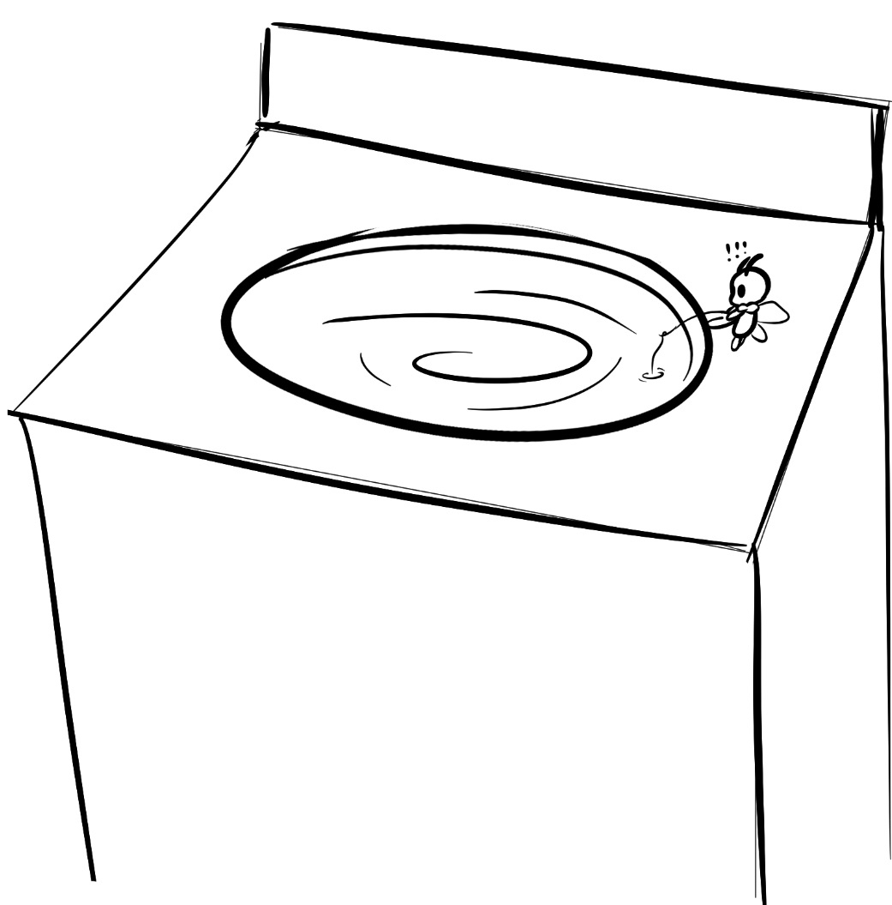

Here's a good question though, but why?

Well, moths are known to eat your fabric, so I think it fits. I want the game to take one of two directions. Either, you fish up clothes to turn into scraps to munch on. Or, rather than an insatiable appetite for fabric, the moth utilizes those clothes to satisfy their insatiable appetite for new drip (fashion). Each direction has it's own issue that I have yet to solve however.

Issue #1: What would be the endgoal? Sure, you fish to keep yourself alive by eating the fabric, but what then? This path lacks strong progression structure, there's no long-term goal.

Issue #2: I decided to take this path as a spin on a now dead social game called Webfishing, where you fish with others in a social setting to fill out your fish catalog and earn money at the same time to acquire different cosmetic items and show off to others. But therein lies the issues for this direction: my inability to code multiplayer functionality, as well as coding and modelling many different kinds of fish and cosmetics to earn.

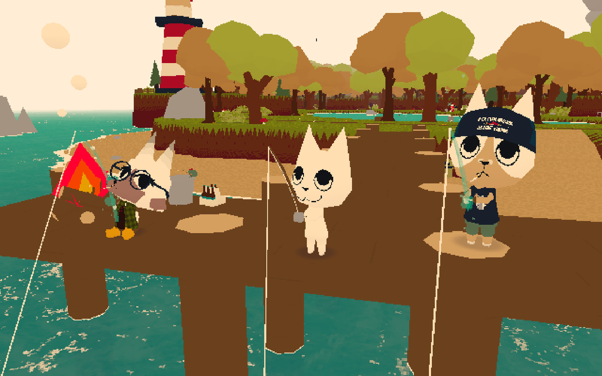

That is why I decided to skip the middleman entirely and fish for new clothes directly rather than catching many different types of fish and obtaining clothes from there, eliminating the need for different types of fish. This is a less satisfying experience in my opinion but one that seems more doable and satisfying in the long run. Multiplayer in my experience, for fishing anyways, is not needed. The simple goal of (completion) collecting all cosmetic items while fishing is usually satisfying enough for most. I run into an issue I stated earlier though: modelling all the cosmetic items. This is a long process that I'm not sure I will be able to accomplish. If so, I will need to keep the number of cosmetics low, maybe around a dozen for the scope of this game with recolours included.

This concept is much smaller in scope and doable, yet comes with its own set of challenges:

1. As I said before, modelling all cosmetics will be time consuming.
2. 3D animation. I will keep it simple, but I have still not yet animated anything in 3D, it will be a challenge.
3. Utilizing 3D in Unity. I have not yet attempted anything within the 3D studio in Unity, so it will take some time.
4. Extra minigames/variables to keep the game from immediately feeling repetitive.

For the latter, the fishing process itself will be a minigame, but I have not yet decided on any other variables to keep the game from getting too stale too quickly, even with its short length. I thought of two so far, but I am still not sure.

Either, fish will be included within the game, but rather act as an antagonizing force that may take away the clothes from your line, so you must keep them at bay utilizing repellent or something (don't ask how fish got into a washing machine), which will act as another layer of depth to the fishing minigame. Or, the washing machine may speed up at times and you must keep your footing to not be swept away when it gets too strong by inputting specific movement keys. The issue with the latter is that I want the game to be chill, so it can't be anything too intense or frequent.

### Look/feel

I decided to start this time with a look/feel prototype rather than implementation, which I have been doing so far up until this point.
I DO have a fishing minigame in mind, as I may make it similar to Guild Wars 2's fishing minigame, one I find quite fun. As shown in the screenshot below, you must maintain the green bar within the yellow area to weaken the fish's strength (shown as the small yellow bar at the bottom). The green bar representing the fish may change directions at random and will have random speeds, so your reaction time may have to be fast at times.

For the overall look and style of the game, I want to keep it cute but very simple and easy to work with, similar to the Sky: CotL models shown here, except simplified even further in my sketch.

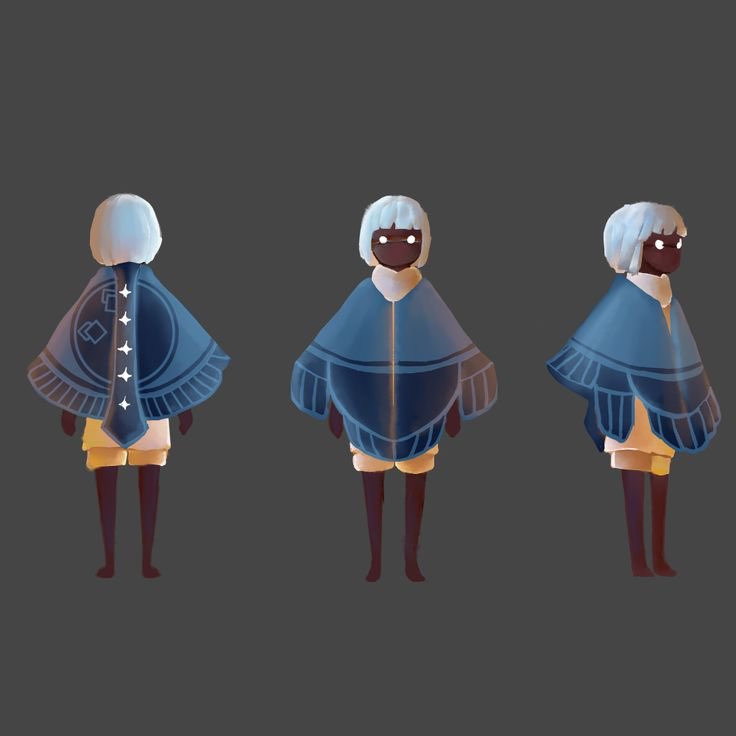

My Sketch of the front and side view:

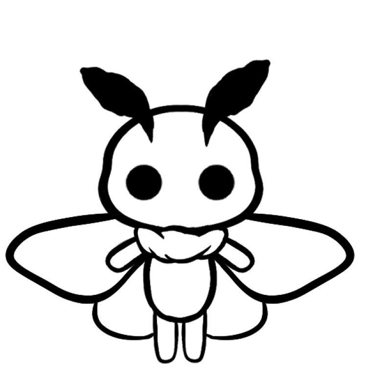

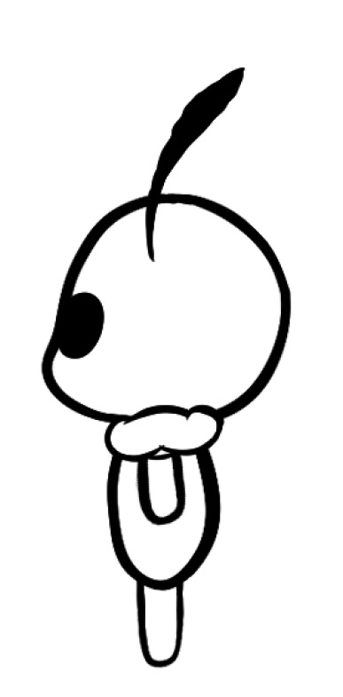

I did begin to sketch a different chibi style earlier as shown here:

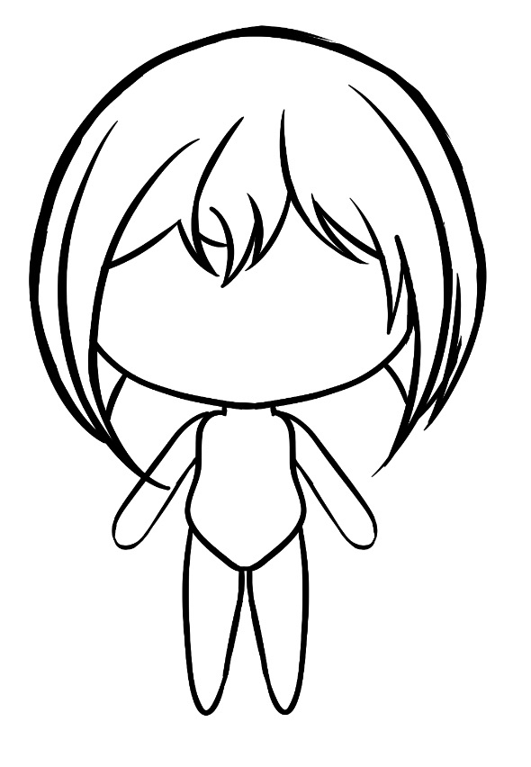

But I realized as I was drawing the hair, this would not only indirectly complicate the models, because I KNOW people would want to change their hairstyle, so I did away with hair entirely to avoid this issue. But also because I wanted to keep the player gender-neutral.

The fishing rod will also be a simple bent paperclip with string, as it's a common household item that you can find anywhere, and light enough for a cartoony moth to hold. The wings I decided upon are also in the image.

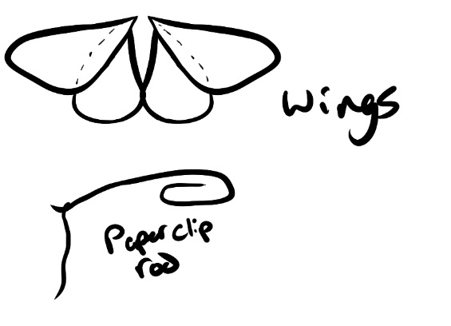

These sketches translated quite well into 3D as shown by my moth here, which is great as I wasn't sure if a chibi-style drawing would translate well into 3D.

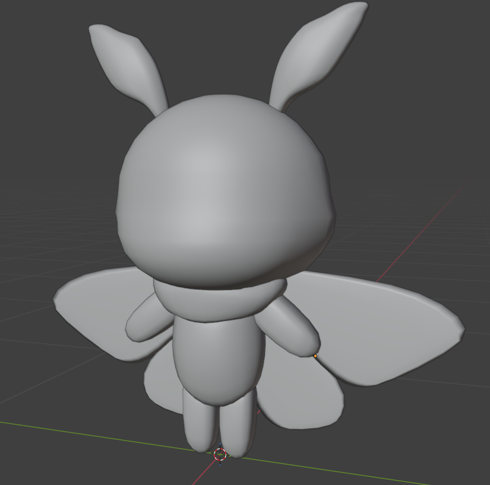

However, as you can see, I have yet to texture it. This is what I'm still going to test out first, as I don't know what visual style I want for my game yet. Like my model, it will be simple and low fidelity, utilizing bright colours and minimal shading, but I have yet to try anything in practice yet. This is my goal for my next journal: Figure out the visual style, model other components of my game, and figure out a more focused idea of what I would like to achieve by the end of this project.

# Third Ideation Prototype | Process Journal

## 03/18/2026

### Initial Concepts

I feel like I was still too ambitious last week. If I had more time there would be many things that I think would be beneficial to a game like mine. However, I must cut some things and keep the scope of my game on the smaller side to accomodate the little time I have left. Therefore, the concept of fishing for your own clothes will be completely scrapped.

Since then, I have been constantly thinking about what I really want my game to be and what I want the player to experience. Thinking about it as less of a game but more of an experience.

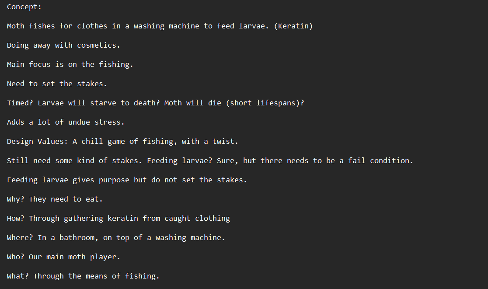

I started jotting down ideas to give myself a more clear vision as to what I wanted to focus on and what I wanted my concept to be. As you can see, I initially embraced the realistic aspect about feeding your moth children (larvae) by fishing for keratin that is contained within clothes. There were some stakes but I still wanted to keep it mainly chill, and I did want a twist of some kind on the classic action of fishing.

However, I have since done away with the initial concept and will be cutting out the middle-man. I will be embracing the 'moths eat clothes' stereotype and make it a game about survival. At least, that's what I hope to achieve. The fishing will be challenging, but needed to be done in order to feed yourself and keep yourself alive. The stakes will be higher as failing too many fishing minigames will starve the moth. Therefore, in order to win, the player must succesfully complete sequential fishing minigames in order to feed themselves and stay alive.

### Core Design Values and Player Experience

My core design value will therefore be: Survival through skillful fishing.

With my sole focus now being on the action of fishing itself, I did some more brainstorming.

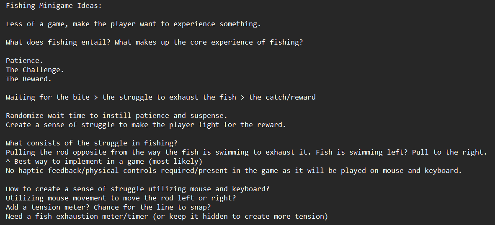

I thought about the actual experience of fishing. How it can be both relaxing and intense once a fish bites the line. It creates suspense, as the fisherman does not know how long it will take for a fish to bite. Therefore, a randomized timer will be added for each fishing minigame to begin once the line is cast.

This further got me thinking about how occasionally, a fish may bite the line, but the hook will not lodge itself effectively, needing further input from the fisherman to quickly tug on the rod to lodge the hook through a fish (in order to begin reeling). A potential quicktime event may help convey this feeling, as the player will need to be quick on their feet, and could increase the suspense before the minigame.

This quicktime event could be needing the player to press a random key on their keyboard within a very short amount of time.

This requires the player to both be patient and have fast enough reaction time to begin fishing. Already this is sort of building a foundation on the experience I want the player to have.

Next comes the fishing itself. Fishing is obviously a physical pass-time. This is something that would be possible to convey in a game through the use of an external device/motion controller and/or something with haptic feedback (look at Wii Sports). However, as I am using only mouse and keyboard, this would not be possible.

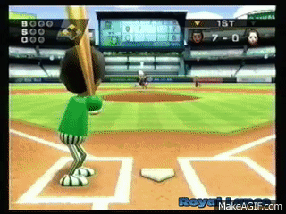

Therefore I would need to find a way to convey the sense of tension and challenge through this one control scheme.

The mouse, being a device that has motion input would be the obvious choice in this scenario. My immediate thoughts gravitated towards the active part of fishing, where you must tire the fish out before reeling it in, by pulling in the opposite direction in which the fish is trying to escape. Oftentimes they are sporadic and will change directions frequently to throw off the fisherman and potentially snap his line.

This will be the win/loss condition of the minigame: a tension and/or exhaustion meter to keep track of whether the player is succesful at tiring and catching the fish, or failing will snap the line. As shown in my notes, it may remain invisible to keep the player on their toes and add to the challenge.

Looking back, this may also create a degree of frustration in the player, so I may keep it visible. Just like in real life, you will have no idea as to how close you are to either tiring the fish out or if it will end up snapping the line, therefore it remains on point with the experience. But this is still a game at the end of the day, and making it invisible may just end up frustrating the player and making them quit.

### Adding more layers onto difficulty

Regardless, as shown in my last journal, I am taking heavy inspiration from Guild Wars 2's fishing minigame, at least in terms of UI and how it functions. It works, and out of all the fishing minigames I have played over the years, it's one of my favourites and the most engaging. It could sometimes be challenging through the speed of more rare fish, but I find it to be quite simple in terms of difficulty.

Once again, I thought back to the experience of fishing, where it becomes significantly more difficult to tire the fish out if it is at the longest points away from the center, which is to the left and right. I decided to mimic this by slowing down and adding "tension" to the user's mouse while near the edges of the fishing bar.

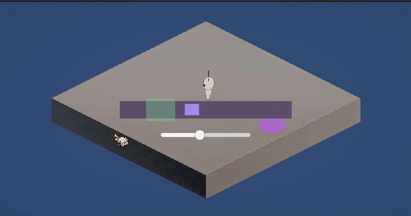

It adds a layer of difficulty to the fishing on top of everything else. This implementation prototype still requires a lot of tweaking and changes, but for now this is what I have for just the base fishing minigame.

### Aesthetics

While I have been thinking about my player experience and the core gameplay design that I wanted for my game, I began to work on the models and a little bit of the style. Despite the challenge I want to add, I'm still going to keep this game simple in its aesthetics.

I began by just simply finding a colour palette and seeing how it would look if I were to very roughly colour the sketch I created last week. I found one that I liked and will be sticking with it.

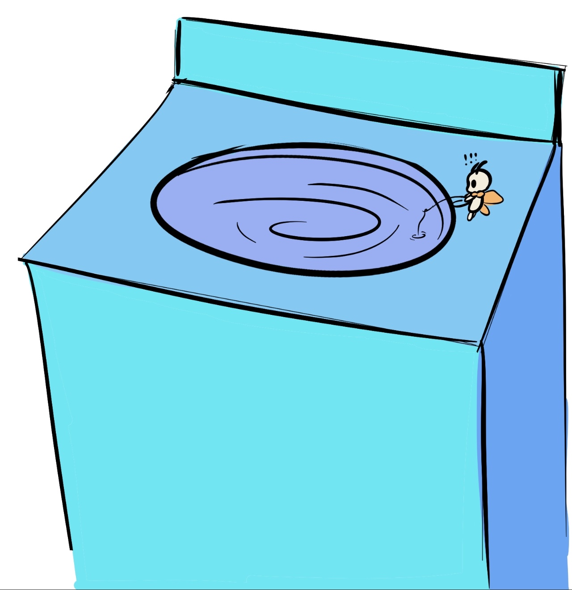

I also managed to texture and create the rigging for my base moth model, again from last week.

I went with this super flat shading style with an outline that is inspired by (once again) Okami with it's use of outlines and also a game called Monument Valley which was my main inspiration for this flat shading style.

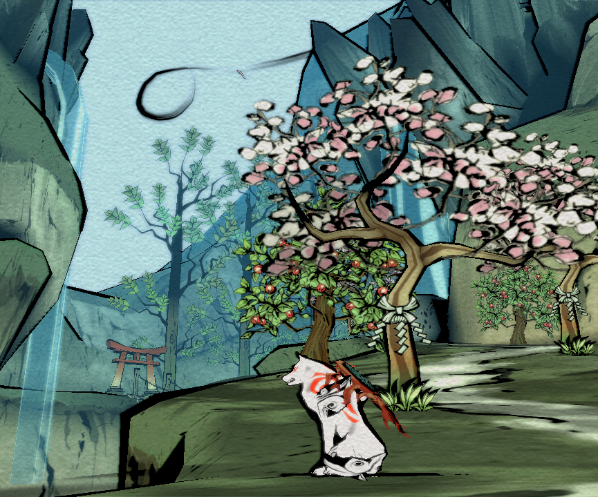

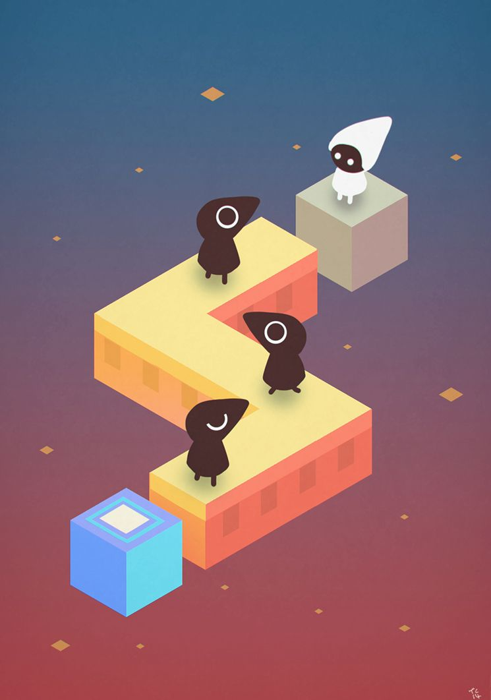

This was the result in Blender.

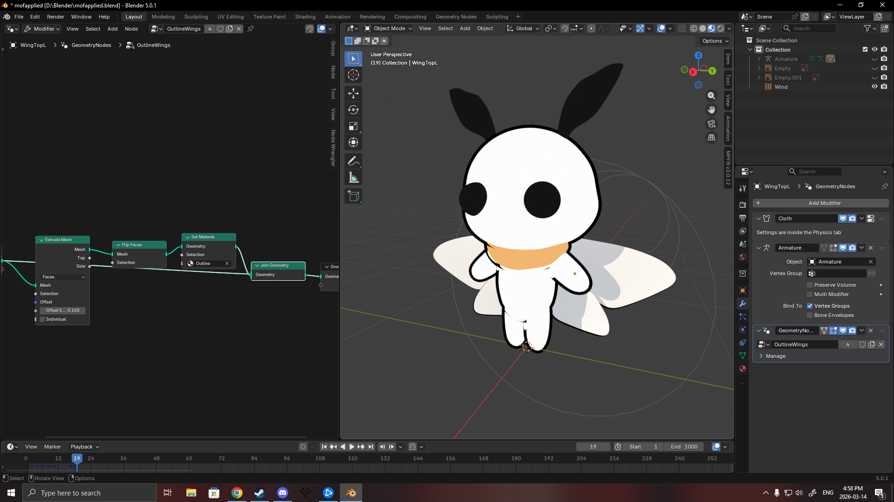

There was one issue though, as I would not be able to export the outlines (which used geonodes) to Unity. Thankfully, I found these two tutorials that teach me how to do exactly that. https://www.youtube.com/watch?v=Bm6Bmcjd1Mw https://www.youtube.com/shorts/FyEiPibJuRU

I would later find out by the time I got my model to work in Unity, that I'd have a ton of issues doing this despite both of the tutorials, and as of writing this I still can't seem to figure out what the issue is.

### Rigging and Animating

Blender has an addon called Rigify that helps immensely with rigging, as if you were creating a human model, whether detailed or not, has prebuilt skeletons to use. However, as you saw, my moth is not human. I had to create the entire rigging from scratch.

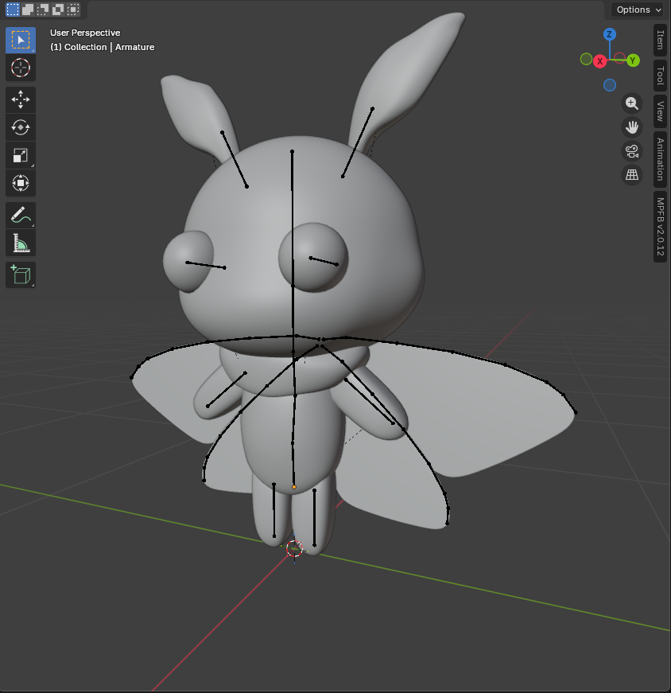

The skeleton wasn't so bad, but what took me hours was the weight painting that I also had to do from scratch in order to make the joints work. This was the most tedious and time-consuming process, but also the most rewarding. As once I finished, I was able to create a simple Idle animation.

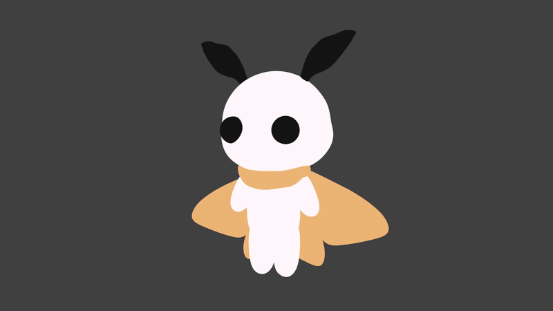

The walk/run animation on the other hand was not so simple, and took me a long time as I had no reference to go off of. It still isn't great by any means but for someone who doesn't animate, I am quite happy with the result.

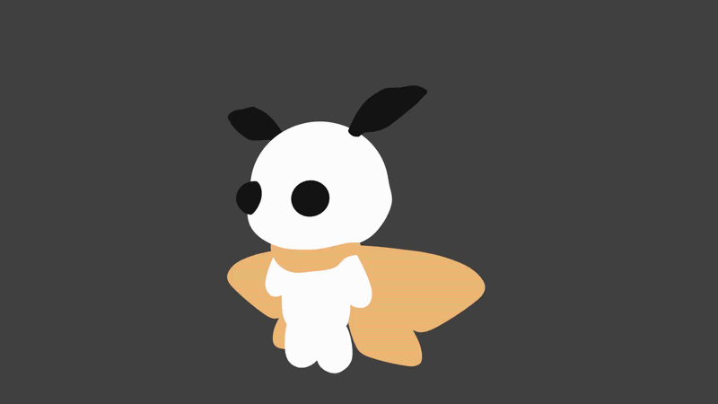

### Exporting to Unity

This was something I have never done before, so it was quite the learning process. I followed this tutorial which helped a lot. It also helped me with adding my two animations.
https://www.youtube.com/watch?v=xqBB4UghJHk&t=7s

It took a few tries, as my biggest issue was that my wings only appeared on one side while being completely invisible when facing away. As I later found out, this was due to the normals of the model only facing one direction because my wings were flat planes. Therefore, I had to go back into blender, separate the wings from the rest of the body, add a solidify modifier, and exported it back into Unity, which solved the issue. This is because the normals on flat planes only ever face one direction.

I also had the issue of an axis mismatch, which made the walking animation look weird. Once again, I had to go back into blender, scrub through my animations and rotate the model to the correct axis.

Despite the growing pains, the end result was one of immense satisfaction. Seeing your creating working as intended within a game engine brought me so much joy.
I don't express myself much in these but I have to say: Look at him. He's so silly, I love seeing him run around.

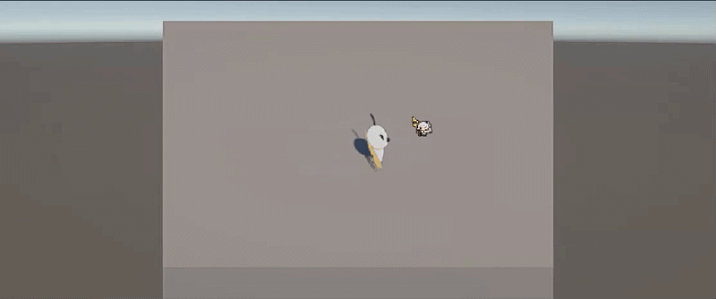

Overall, this was a very time-consuming week but I am so glad I made significant progress in the style/aesthetics, as well as finding a more focused direction as to where I want to take my game and what I want the player to experience.

# Fourth Ideation Prototype | Process Journal

## 03/26/2026

### Slow week, weak visuals

This journal entry will be shorter as not much happened over the course of this past week. It's been a really slow week and I have been generally exhausted and have not worked on much, which is a shame considering the amount of work I did last week.

### What have I done?

So I began by modelling the main washing machine the moth will be standing atop of, as well as a dryer to place next to it, mainly for background purposes, and a window. The latter I will explain later.

I started with just the washing machine and quickly made the dryer because I felt like it and I thought it could add a bit more visual detail to my simple game.

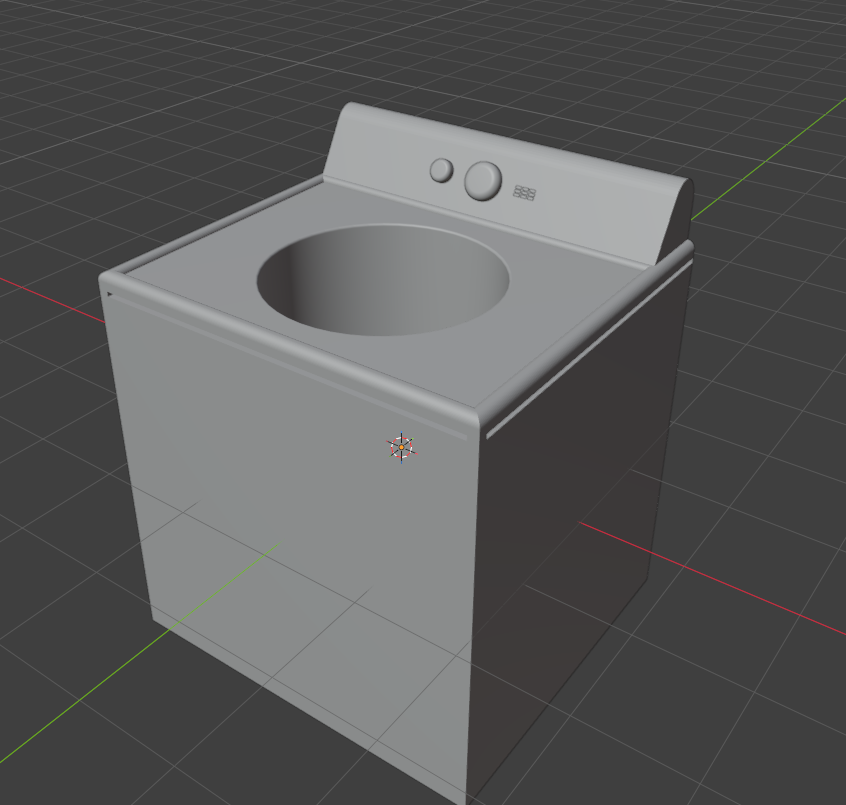

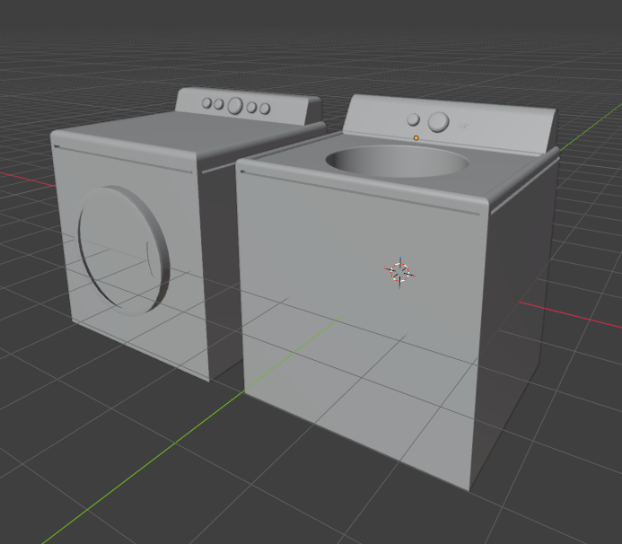

With that done, I began to colour them. I utilized the colour palette I created last week but I had an issue. It was way too bright. The colours I previously chose were way too vibrant, my eyes hurt just looking at it.

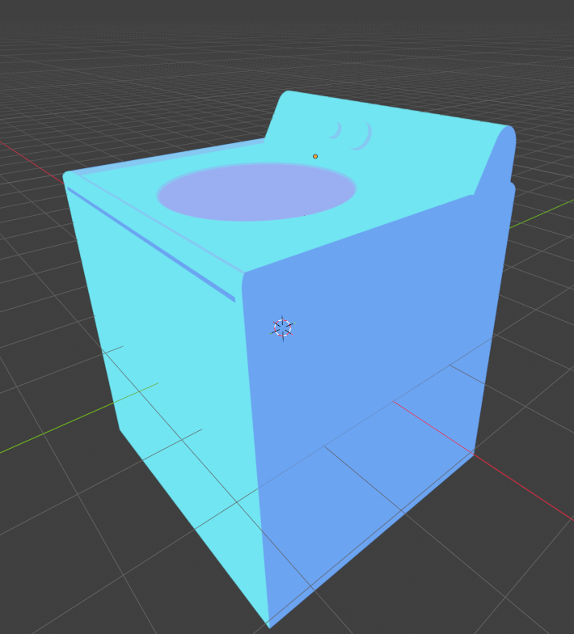

I realized too there would be some issues with contrast. Even with the orange wings, the bright white on bright cyan from the moth would make it difficult to follow the little moth as most people's eyes would probably be singed during the process. The bright on bright colours just provided very little contrast and may cause visual confusion to some players. I tried utilizing desaturated variants but the same issue still continued to occur, so I decided to ditch the previous colour palette.

Rather, I found a darker but flat visual style I liked on Pinterest from a piece of artwork and created my own colour palette. I tried using Adobe Colour but found it limiting.

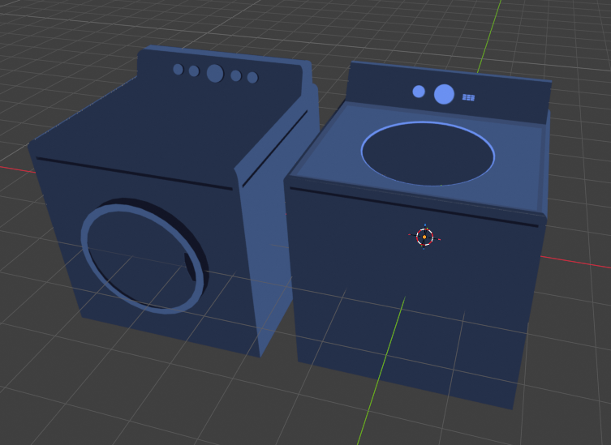

With this new palette in mind, I decided to go down a route I previously thought about but disregarded, and that was to set the game during the night. Moths are known to be drawn to light as they navigate utilizing it. I thought about utilizing emissions and having my water glow, which may explain why the moth was attracted to the washing machine in the first place. If I were to use light however, I may have to do away with the unlit/flat shading I initially desired.

I still don't know, I may change the visual style many times in the upcoming weeks, I have ideas going down both routes but I have to see which sticks and looks best.
This was also why I made a window, as I could use it as the main source of light for the scene. I still haven't decided on my main camera orientation yet either so whether it's visible or not, I don't know. It took about 2 minutes to make so it wasn't a waste of time, just something quick that may be useful later on.

This is their general placement and current visual setup in scene view.

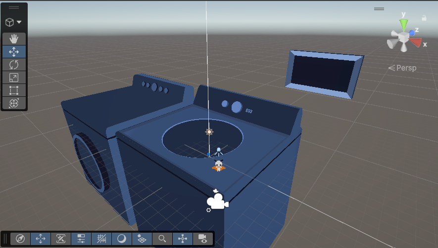

I also added a mesh collider to the washing machine and invisible walls that would prevent the player from running off.

### What didn't I do?

A lot. I barely accomplished any of the goals I set out for myself this week.
Which included:

- Modelling the fishing rod
- Creating casting and reeling animations
- Adding the water asset I found a while back
- Implemented a prototype of my second minigame idea
- Thought about 2 other prototype ideas
- Finalized visual style and cohesion

There was a lot I did not accomplish.

The only partially complete one was that I thought about at least my second minigame, which will be an Osu typing minigame, where the player must watch for shrinking rings and press the corresponding sequenced letters on their keyboard in time.

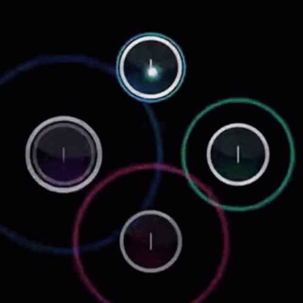

The thought about utilizing the mouse for this minigame did cross my mind, as Osu differentiates itself from other rhythm games by focusing on such, but I'm worried it will hurt accessibility for my simple game. First off, I am aware that not everyone will have a mouse, and even those with laptops will struggle. Trackpads I find to be extremely unreliable which could really mess up some players that will be playing my game on their own laptops or computers. I am largely creating this game on a laptop with trackpad myself so I can first-hand see how it will affect others playing my game to those who are in a similar position.

My initial minigame prototype was fine, it wasn't an instant loss and gave a lot of leeway to catch up while still maintaining a challenge. An Osu-styled minigame however would be much more unforgiving.

Moreover, Osu and similar games ask the player to have a great deal of accuracy and precision with the mouse. I play a lot of shooters, so that is something I am fine with. I'd say that most other players do not, and may struggle with this aspect, thus limiting accessibility even further.

Sure, there are ways to tweak it and make it more accessible, but why bother going through that effort when I can just utilize key presses and somewhat fast reaction time to achieve my goal and bypass all those headaches in the process.

As I did not do any kind of implementation, I will not be showing anything, but at least I have 2 out of the four minigames thought of.

### Issues

I had a few issues over the course of the work periods I set for myself.

One that I eventually solved were textures not embedding into the FBX files when I imported them. I realized because I was utilizing just an emission shader node rather than the Principled BSDF node in Blender, as Unity can't read just sole emission nodes.

The other annoying problem I has was this one.

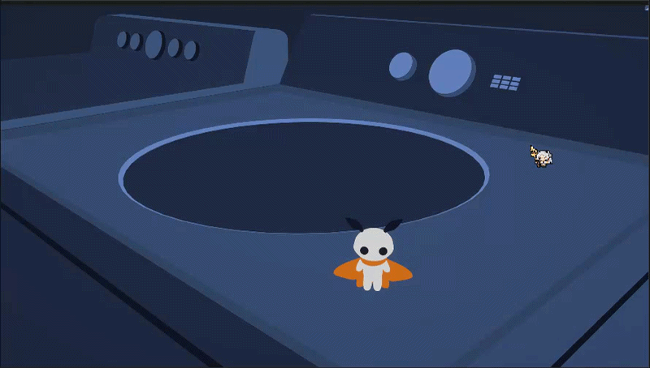

Spawning in when starting the game would cause my moth to rotate 90 degrees and hover over the surface. I have absolutely no idea what is going on. I checked the base FBX, the mesh itself, as well as the bones and armature.. and none of them seemed to have been the issue. It may have to do with my blender file, although I am not sure. It's weird and really messing with the collisions on some of my objects. I still can't figure this one out and will have to return to it.

Lastly, I am still having trouble with the black outlines I want to implement, although I may have to abandon them entirely if I can't figure out how to make it work. I'll see later on.

### What's left?

A great deal of work, and quite frankly too much to list here. I will set my goals for next week to finish what I started this week, and hopefully then some. I need to pick up the pace again, as I also have a few other projects due in a few weeks time, so time is critical right now.

# Fifth Ideation Prototype | Process Journal

## 04/02/2026

### Low energy, low motivation

Similar to last week, this week has been rough, with all the projects due soon and a heavy workload, my energy and motivation have not been lower since. I once again fell short of the goals I had and worry as to how my final project will turn out. Writing these journals and documenting has been getting increasingly more difficult as well, but I will prevail.

### What did I set out for myself and what did I accomplish?

I wanted to:

- Have a more defined visual style
- Finish all 4 planned minigames
- Implement the fishing mechanic
- Create fishing animations
- Create the fishing rod
- Create the cloth visuals

Despite low energy, I did manage to accomplish more than last week. I managed to create the fishing rod, in all its paperclippy glory.

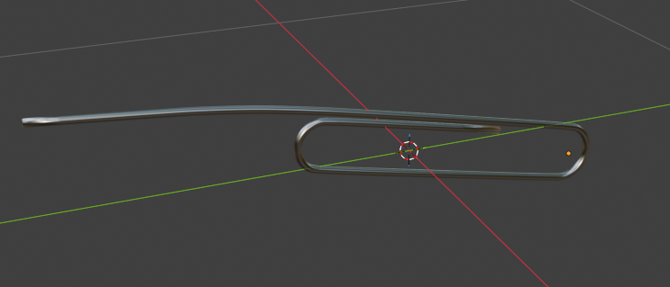

I managed to create the 3 state animations for fishing, that being the casting, idling and reeling animations.

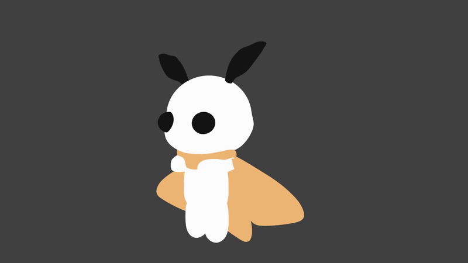

Although they are significantly lower quality and do not have any kind of polish. I really wanted to make these look good but I just do not have the time to spend as much as I did for the initial running animation. Furthermore, the moth is tiny so it won't be too noticeable at least.

I also managed to finalize a more coherent visual style, which was not planned originally but I think it looks quite nice. I spent last class with Malcolm going over to see how I would be able to somewhat replicate Monument Valley's art style and visuals, especially the lighting. He seemed to have a better eye than I did with being able to tell how the lighting was set up in these screenshots, so I appreciate his help greatly.

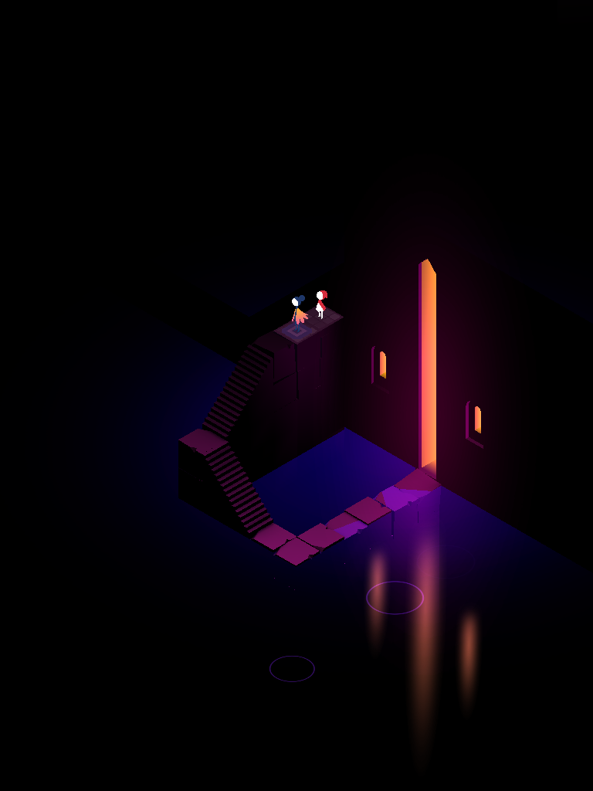
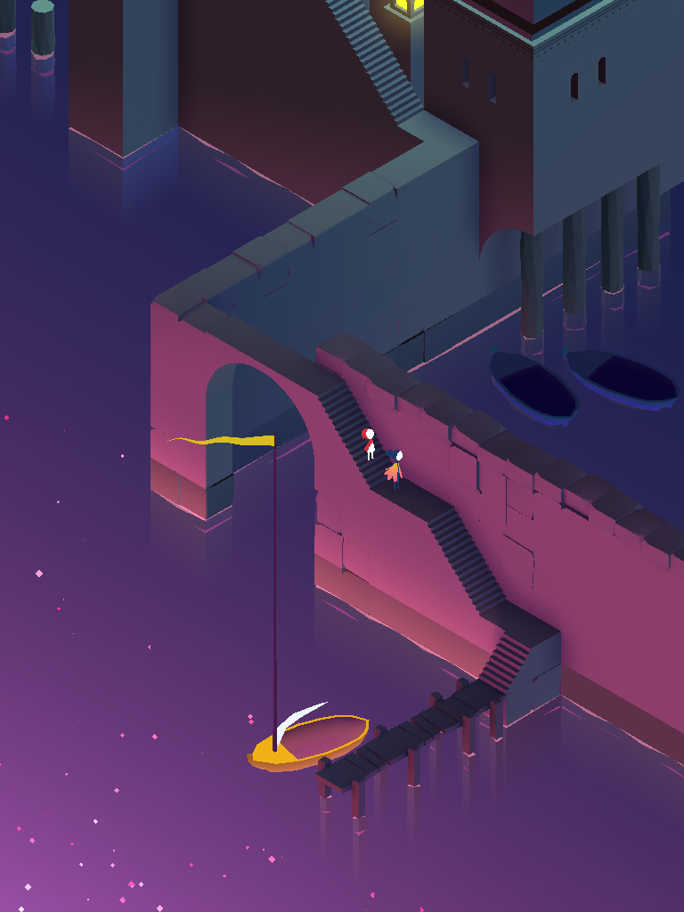

The style uses a lot of different lights that affect only very specific objects which I was able to accomplish through layers, culling masks and in the project lighting settings to achieve a similar look.

The moth stands out a bit and does not fit in as well with this aesthetic, which I boil down to colour preferences as well as character design, but it's still fine. I may tweak the lighting a bit but I was able to achieve a flat colour scheme with emissions and selective lighting.

There was an issue with a spotlight I had parented to my moth, which used to show but out of nowhere it just kind of stopped working.

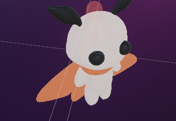

As shown here it exists and as far as I'm aware, should be working as it has been all of this time, yet it doesn't. I added this light as both a stylistic choice and for contrast. It adds a subtle glow beneath the moth to highlight the player's position at all times which also fits in with the Monument Valley-esque style I'm going for. I spent a while trying to figure out what the issue was, yet I have not been able to fix it.

On top of all of that, I was able to utilize a free Unity store asset for my water, which I then tweaked heavily to match the visual style, which I think resembles the second monument valley screenshot above greatly. It looks nice and fits in.

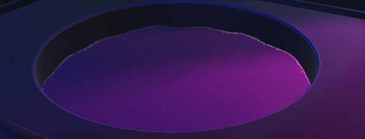

I did want to try and make the water swirl, as if the machine was turned on. I played around with the shader graph that created the water, but after a while I gave up. I didn't want to spend a crazy amount of time on it so I just left it as is. There were too many nodes in there with a system that I barely understand. Despite my efforts I couldn't accomplish it.

### Speaking of not accomplishing...

I have already begun to see many issues with both my process and what I will be able to deliver.

Despite telling myself last week to focus on gameplay first and visuals second, my designer brain still refused to budge. Out of the 1 implemented minigame and 2 other ideas I have, with 1 additional one I need to think about, I implemented nothing. This is priority number 1 for me. As much as I want to add a menu system and nice UI, I think I will just skip on it and focus on gameplay, because as of right now, it looks nice, but that's about it.

This highlights a larger issue I have with my game, and that is how shallow it is and how it veers off from my original pitch of fishing for survival.

There is nothing on a gameplay or visual level that indicates "hungry" in my game. Sure, I could and will implement a hunger bar, but that will just clash with everything else I have done. The animations, visuals and everything scream bright and bubbly, not of desperation and hunger. I could implement a mechanic where you start off slow, and the more you fish and eat the faster you get, and even make a separate animation for slower walking. That is one path that I could take. It will probably be the one I stick with.

As I sat here pondering on it for a while, I realized I could switch my focus once again to being more "scenic" and focusing on the minigames entirely. However, there's nothing really scenic in my game. Sure, visually it looks nice, but the camera is static and so is the environment with very little visuals to admire aside from the lighting. I may have the camera zoom in onto the moth when it fishes but that's it for dynamic visuals.

I'm further reinforcing a big problem I have not only in game design but just in design as a whole, I spent so long focusing and working on the visuals, yet I fail to convey their meaning or make the game fun in this case. This is my absolute worst trait I have as a designer as a whole that I am struggling to break free of. I am quite literally telling myself to focus on the experience and gameplay or meaning, yet I still betray myself and focus solely on the surface-level visuals that do not compliment the game in this case.

### Moving forward and more mistakes

I will focus solely past this point on the minigames and the experience of fishing. I will first implement the minigames and tweak them accordingly. Thankfully I have already implemented the fishing animations to convey this as seen here, so it's just about finishing the gameplay aspect of it.

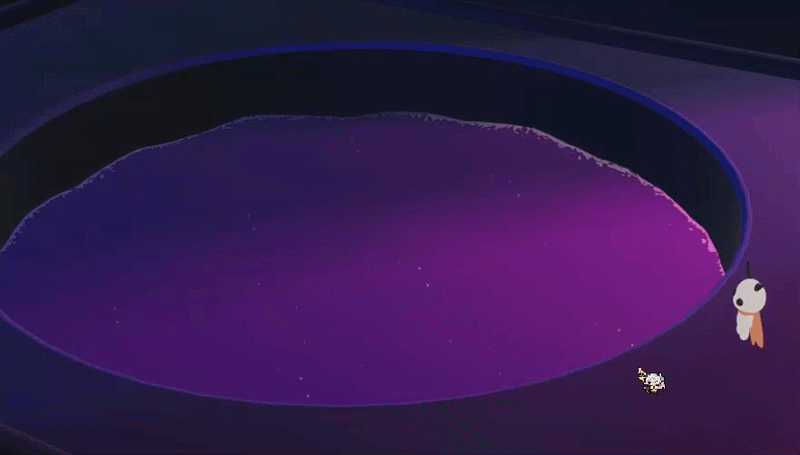

It's not polished and I just implemented it, I will see if I can add physics without the line being cast instantaneously but that will be lower on my priority list.

I was thinking of adding a whole menu screen and gameover but at this point it will be a lot of effort for the little time I have left. I will add simple UI elements later on and that will be it.

I also need to sketch up a few quick different pieces of clothing to fish and have them float in the water as shadows. Each piece of clothing will give differing amounts of hunger back. I think I will just stick with the faster movement thing I proposed earlier, where you start off slow and after some fishing you will be able to move around faster.

Thinking about movement also made me realize something else. What's the point of 3D? I created these objects, animations, and physics for what? This could have easily been done in a 2D pixel art style in first person without the need for complex 3D animations and physics. Just some simple 2D animations to focus on the minigames. Because as of right now, the 3D aspects serves absolutely zero gameplay purpose other than just for visual flair. It took me a while to realize this but I have complicated so many things for myself way too much.

Regardless, as a junior designer I will learn from these mistakes and hopefully improve in the future. I will most likely cover this in my last journal entry but it's important to mention it now while it's in my head, with all these setbacks and poor design choices I have made.

I will simply finish what I have started by this point. I will now think of a quick elevator pitch as suggested to sort of also help guide myself as to what I want to have done by next week.

### Elevator Pitch

A weakened moth must conquer fishing-based minigames to regain its strength and take flight once more.

This is the one sentence elevator pitch that I will stick with now. I will not implement any flying, but I imagine that if I had more time, that would be the end goal and pay-off, allowing the player to freely fly around the room.
